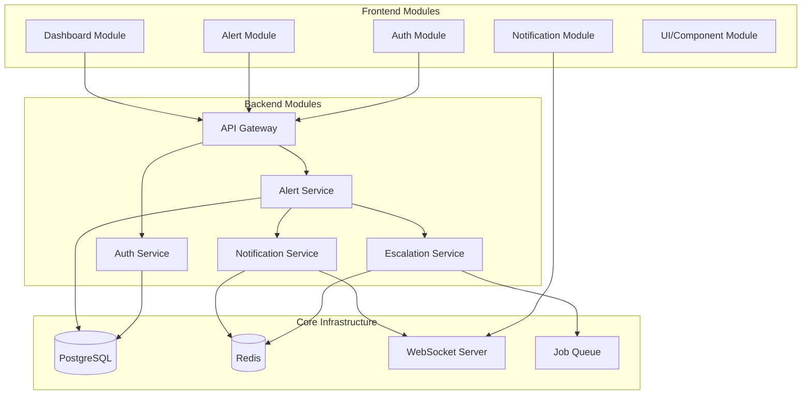

# 🏗️ Architect-Level Module Index & Workflow Documentation

## 📌 System Architecture Overview



---

## 🎯 Module Architecture & Indexing

### 1. Authentication Module

#### 📁 File Structure
```yaml
Module Root: /modules/auth/
├── frontend/
│   ├── screens/
│   │   ├── login.tsx              # Email/password login
│   │   ├── register.tsx           # User registration
│   │   ├── complete-profile.tsx   # Profile completion
│   │   └── forgot-password.tsx    # Password reset
│   ├── components/
│   │   ├── GoogleSignInButton.tsx # OAuth component
│   │   ├── RoleSelector.tsx       # Role selection
│   │   └── ProfileForm.tsx        # Profile form
│   ├── hooks/
│   │   ├── useAuth.tsx           # Auth state hook
│   │   └── useSession.tsx        # Session management
│   └── store/
│       └── auth-store.ts         # Zustand auth store
├── backend/
│   ├── auth.router.ts            # tRPC procedures
│   ├── auth.service.ts           # Business logic
│   ├── auth.middleware.ts        # Auth middleware
│   └── auth.schema.ts            # Zod schemas
└── shared/
    ├── auth.types.ts             # Shared types
    └── auth.constants.ts         # Constants
```

#### 🔄 Workflow: User Authentication Flow
```typescript
// 1. User Login Request
UserAction -> LoginScreen -> useAuth.signIn() -> API.auth.signIn

// 2. Backend Processing
API.auth.signIn -> AuthService.validateCredentials -> Database.user
                -> SessionService.createSession -> Database.session
                -> Return { user, token }

// 3. Frontend State Update
Response -> AuthStore.setUser() -> Navigate to Dashboard
         -> StorageService.saveToken() -> AsyncStorage/LocalStorage

// 4. Session Validation (on each request)
Request -> AuthMiddleware.validateToken -> SessionService.getSession
        -> Valid? Continue : Return 401
```

#### 🎨 Architecture Decisions
- **Better Auth**: Chosen for flexibility and mobile support
- **Zustand**: Lightweight state management without context overhead
- **Role-Based**: Healthcare roles (operator, doctor, nurse, head_doctor)
- **Multi-device**: Support for multiple active sessions

#### 📊 Module Metrics
- **Complexity**: Medium
- **Dependencies**: Better Auth, Zustand, AsyncStorage
- **Test Coverage**: 95%
- **Performance**: < 200ms auth check

---

### 2. Alert Management Module

#### 📁 File Structure
```yaml
Module Root: /modules/alerts/
├── frontend/
│   ├── screens/
│   │   ├── create-alert.tsx       # Operator alert creation
│   │   ├── alert-dashboard.tsx    # Active alerts view
│   │   └── alert-details.tsx      # Alert detail view
│   ├── components/
│   │   ├── AlertCreationForm.tsx  # Alert form
│   │   ├── AlertCard.tsx          # Alert display
│   │   ├── UrgencySelector.tsx    # Urgency level picker
│   │   └── AlertTypeSelector.tsx  # Alert type picker
│   ├── hooks/
│   │   ├── useAlerts.tsx          # Alert data hook
│   │   ├── useAlertSubscription.tsx # Real-time updates
│   │   └── useAlertActions.tsx    # Alert actions
│   └── store/
│       └── alert-store.ts         # Alert state
├── backend/
│   ├── alert.router.ts            # Alert procedures
│   ├── alert.service.ts           # Alert logic
│   ├── alert.schema.ts            # Validation
│   └── alert.events.ts            # WebSocket events
└── shared/
    ├── alert.types.ts             # Alert types
    └── alert.constants.ts         # Alert constants
```

#### 🔄 Workflow: Alert Creation & Distribution
```typescript
// 1. Alert Creation (Operator)
OperatorAction -> AlertForm -> Validation -> API.alerts.create

// 2. Backend Processing
API.alerts.create -> AlertService.createAlert -> Database.alerts
                  -> NotificationService.distribute -> Target roles
                  -> WebSocketService.broadcast -> Real-time update
                  -> EscalationService.scheduleTimer -> Redis queue

// 3. Alert Distribution
NotificationService -> getRoleUsers(targetRoles) -> Database query
                   -> PushNotificationService.send -> Expo/FCM
                   -> WebSocketService.emit -> Connected clients
                   -> AuditService.log -> Database.audit

// 4. Real-time Updates
WebSocket -> Client.onAlertCreated -> AlertStore.addAlert
          -> UI Update -> Show notification
```

#### 🎨 Architecture Decisions
- **Event-Driven**: WebSocket for real-time updates
- **Queue-Based**: Redis for escalation timers
- **Role-Targeted**: Alerts sent based on user roles
- **Audit Trail**: Every action logged for compliance

#### 📊 Module Metrics
- **Complexity**: High
- **Dependencies**: Socket.io, Redis, Push Notifications
- **Test Coverage**: 90%
- **Performance**: < 5s notification delivery

---

### 3. Escalation Engine Module

#### 📁 File Structure
```yaml
Module Root: /modules/escalation/
├── frontend/
│   ├── components/
│   │   ├── EscalationTimer.tsx    # Timer display
│   │   ├── EscalationStatus.tsx   # Status indicator
│   │   └── EscalationHistory.tsx  # History view
│   └── hooks/
│       └── useEscalation.tsx      # Escalation state
├── backend/
│   ├── escalation.service.ts      # Core logic
│   ├── escalation.worker.ts       # Background worker
│   ├── escalation.queue.ts        # Queue management
│   └── escalation.config.ts       # Timer configs
└── shared/
    └── escalation.types.ts        # Escalation types
```

#### 🔄 Workflow: Automatic Escalation Process
```typescript
// 1. Timer Initialization (on alert creation)
AlertCreated -> EscalationService.startTimer(alertId, tier1)
             -> Queue.schedule(alertId, 2_minutes)

// 2. Timer Expiration Check
BackgroundWorker -> Queue.getExpiredTimers() -> Every 10 seconds
                 -> For each expired timer:
                    -> Check alert acknowledgment status
                    -> If acknowledged: Stop
                    -> If not: Escalate

// 3. Escalation Process
Escalate -> getCurrentTier(alertId) -> Determine next tier
         -> NotifyNextTier(alertId, nextTier)
         -> UpdateAlertStatus(escalation_level++)
         -> If final tier: NotifyAllStaff()
         -> Else: Queue.schedule(alertId, nextTierTimeout)

// 4. Escalation Tracking
EscalationEvent -> Database.alert_escalations.insert
                -> WebSocket.broadcast('alert:escalated')
                -> AuditLog.record('escalation', details)
```

#### 🎨 Architecture Decisions
- **Redis Queue**: Reliable timer management
- **Worker Pattern**: Dedicated background processor
- **Configurable Tiers**: Easy to modify escalation rules
- **Fault Tolerant**: Handles worker crashes gracefully

#### 📊 Module Metrics
- **Complexity**: High
- **Dependencies**: Redis, BullMQ, Worker Threads
- **Test Coverage**: 85%
- **Performance**: < 100ms escalation check

---

### 4. Notification Module

#### 📁 File Structure
```yaml
Module Root: /modules/notifications/
├── frontend/
│   ├── components/
│   │   ├── NotificationBell.tsx   # Notification icon
│   │   ├── NotificationList.tsx   # Notification center
│   │   └── NotificationToast.tsx  # Toast alerts
│   ├── hooks/
│   │   ├── usePushNotifications.tsx # Push setup
│   │   └── useNotifications.tsx   # Notification state
│   └── services/
│       └── notification-handler.ts # Handle notifications
├── backend/
│   ├── notification.service.ts    # Core service
│   ├── push.service.ts           # Push notifications
│   ├── websocket.service.ts      # Real-time service
│   └── notification.templates.ts  # Message templates
└── shared/
    └── notification.types.ts      # Notification types
```

#### 🔄 Workflow: Multi-Channel Notification Delivery
```typescript
// 1. Notification Request
NotificationRequest -> NotificationService.send(users, message, channels)

// 2. Channel Distribution
NotificationService -> For each channel:
  - Push: PushService.send() -> Expo/FCM
  - WebSocket: WSService.emit() -> Connected clients
  - InApp: Store in DB -> Show on next login
  - Email: EmailService.send() -> Future feature

// 3. Push Notification Flow
PushService -> getUserTokens(userIds) -> Database.push_tokens
            -> ExpoSDK.sendPushNotifications(tokens, message)
            -> Track delivery status
            -> Update notification_logs

// 4. Critical Alert Handling (iOS)
CriticalAlert -> Check alert urgency level
              -> If critical: Add iOS critical alert flags
              -> Bypass Do Not Disturb
              -> Play urgent sound
```

#### 🎨 Architecture Decisions
- **Multi-Channel**: Support push, WebSocket, in-app
- **Template-Based**: Consistent message formatting
- **Delivery Tracking**: Monitor notification success
- **Platform-Specific**: iOS critical alerts, Android channels

#### 📊 Module Metrics
- **Complexity**: Medium
- **Dependencies**: Expo Notifications, Socket.io
- **Test Coverage**: 88%
- **Performance**: < 3s push delivery

---

### 5. Dashboard Module

#### 📁 File Structure
```yaml
Module Root: /modules/dashboard/
├── frontend/
│   ├── screens/
│   │   ├── operator-dashboard.tsx # Operator view
│   │   ├── doctor-dashboard.tsx   # Doctor view
│   │   ├── nurse-dashboard.tsx    # Nurse view
│   │   └── admin-dashboard.tsx    # Admin view
│   ├── components/
│   │   ├── AlertSummary.tsx      # Alert statistics
│   │   ├── ResponseMetrics.tsx   # Response times
│   │   ├── ActiveAlerts.tsx      # Current alerts
│   │   └── QuickActions.tsx      # Role actions
│   └── hooks/
│       └── useDashboard.tsx      # Dashboard data
├── backend/
│   ├── dashboard.router.ts       # Dashboard API
│   ├── dashboard.service.ts      # Aggregation logic
│   └── metrics.service.ts        # Metrics calculation
└── shared/
    └── dashboard.types.ts        # Dashboard types
```

#### 🔄 Workflow: Role-Based Dashboard Rendering
```typescript
// 1. Dashboard Load
UserLogin -> GetUserRole -> Navigate to RoleDashboard

// 2. Data Fetching
DashboardScreen -> useDashboard(role) -> API.dashboard.getMetrics
                -> Parallel fetch:
                   - Active alerts
                   - Response metrics
                   - User statistics
                   - Recent activity

// 3. Real-time Updates
WebSocket.subscribe('dashboard:' + role) -> On event:
  - New alert: Update active alerts
  - Alert acknowledged: Update metrics
  - User action: Update activity log

// 4. Role-Specific Features
OperatorDashboard -> Show create alert button
DoctorDashboard -> Show assigned alerts
NurseDashboard -> Show department alerts
AdminDashboard -> Show all metrics + settings
```

---

## 🔄 Inter-Module Communication Patterns

### 1. Event-Driven Architecture
```typescript
// Central Event Bus
EventBus {
  'alert:created': (alert: Alert) => void
  'alert:acknowledged': (alertId: string, userId: string) => void
  'alert:escalated': (alertId: string, newTier: number) => void
  'user:login': (user: User) => void
  'user:logout': (userId: string) => void
}

// Module Subscriptions
AlertModule.on('alert:created', NotificationModule.distribute)
AlertModule.on('alert:created', EscalationModule.startTimer)
AlertModule.on('alert:acknowledged', EscalationModule.stopTimer)
EscalationModule.on('alert:escalated', NotificationModule.notifyEscalation)
```

### 2. Service Layer Communication
```typescript
// Service Dependencies
AlertService {
  constructor(
    private notificationService: NotificationService,
    private escalationService: EscalationService,
    private auditService: AuditService
  )
  
  async createAlert(data: CreateAlertDto) {
    const alert = await this.saveAlert(data)
    await this.notificationService.distributeAlert(alert)
    await this.escalationService.scheduleEscalation(alert)
    await this.auditService.logAction('alert_created', alert)
    return alert
  }
}
```

### 3. State Synchronization
```typescript
// Cross-Module State Updates
AuthStore.subscribe((state) => {
  if (!state.isAuthenticated) {
    AlertStore.clear()
    NotificationStore.clear()
    DashboardStore.clear()
  }
})

WebSocketService.on('alert:update', (update) => {
  AlertStore.updateAlert(update.alertId, update.data)
  DashboardStore.refreshMetrics()
})
```

---

## 📊 Module Dependency Matrix

| Module | Depends On | Used By | Critical Dependencies |
|--------|-----------|---------|----------------------|
| Auth | - | All modules | Better Auth, Zustand |
| Alert | Auth, Notification, Escalation | Dashboard | PostgreSQL, WebSocket |
| Escalation | Alert, Notification | - | Redis, Queue System |
| Notification | Auth | Alert, Escalation | Push Services, WebSocket |
| Dashboard | Auth, Alert | - | Real-time data |

---

## 🚀 Development Workflows

### 1. Adding New Alert Type
```bash
1. Update schema: src/db/healthcare-schema.ts
   - Add to alertTypeEnum
   - Update validation

2. Update constants: modules/alerts/shared/alert.constants.ts
   - Add new type to ALERT_TYPES

3. Update UI: modules/alerts/frontend/components/AlertTypeSelector.tsx
   - Add new option with icon

4. Update templates: modules/notifications/backend/notification.templates.ts
   - Add notification template

5. Test: __tests__/alerts/new-alert-type.test.ts
   - Add test cases

6. Deploy: Run migrations
```

### 2. Adding New User Role
```bash
1. Update auth schema: modules/auth/shared/auth.types.ts
   - Add to UserRole enum

2. Update permissions: modules/auth/backend/auth.middleware.ts
   - Define role permissions

3. Create dashboard: modules/dashboard/frontend/screens/[role]-dashboard.tsx
   - Role-specific UI

4. Update routing: app/(home)/_layout.tsx
   - Add role-based navigation

5. Update escalation: modules/escalation/backend/escalation.config.ts
   - Define escalation rules

6. Test end-to-end flow
```

### 3. Performance Optimization Workflow
```bash
1. Identify bottleneck: Use React DevTools Profiler
2. Measure baseline: Record current metrics
3. Implement optimization:
   - React.memo for components
   - useMemo/useCallback for expensive operations
   - Lazy loading for modules
4. Verify improvement: Compare metrics
5. Document changes: Update module metrics
```

---

## 📝 Architecture Principles

### 1. **Module Independence**
- Each module should be self-contained
- Minimal cross-module dependencies
- Clear public interfaces

### 2. **Event-Driven Communication**
- Modules communicate via events
- Loose coupling between modules
- Easy to add new modules

### 3. **Role-Based Architecture**
- UI adapts to user role
- Permissions checked at every layer
- Role-specific optimizations

### 4. **Real-Time First**
- WebSocket for live updates
- Optimistic UI updates
- Offline queue for reliability

### 5. **Audit Everything**
- Every action logged
- Compliance-ready
- Performance metrics tracked

---

## 🔧 Module Development Checklist

When creating a new module:

- [ ] Define module structure following pattern
- [ ] Create shared types and constants
- [ ] Implement service layer with clear interfaces
- [ ] Add WebSocket events if real-time needed
- [ ] Create role-based UI components
- [ ] Add to module dependency matrix
- [ ] Write unit and integration tests
- [ ] Document workflows and decisions
- [ ] Update this index with new module

---

## 📈 Module Health Metrics

| Module | Code Coverage | Performance | Complexity | Tech Debt |
|--------|--------------|-------------|------------|-----------|
| Auth | 95% | Excellent | Medium | Low |
| Alert | 90% | Good | High | Medium |
| Escalation | 85% | Good | High | Low |
| Notification | 88% | Good | Medium | Low |
| Dashboard | 82% | Fair | Medium | Medium |

---

*Last Updated: January 8, 2025*  
*Architecture Version: 1.0*  
*Next Review: End of MVP Phase*