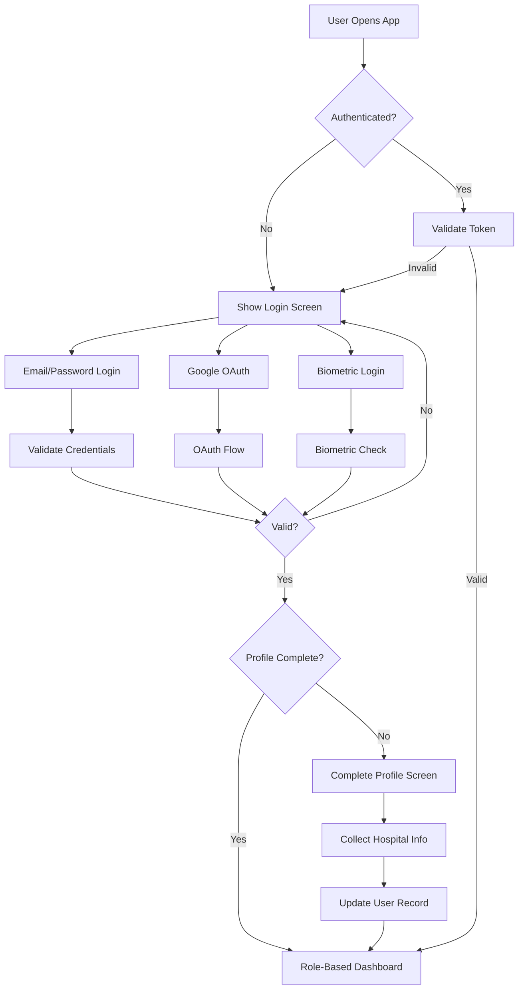
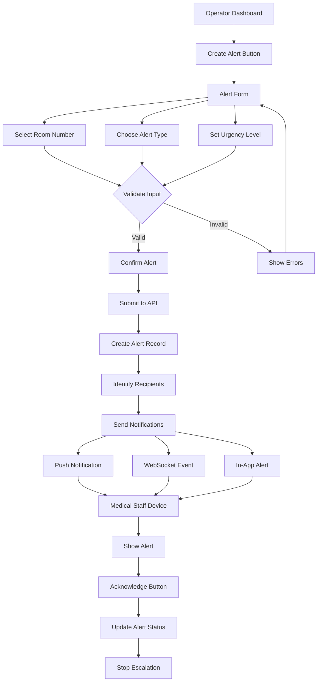
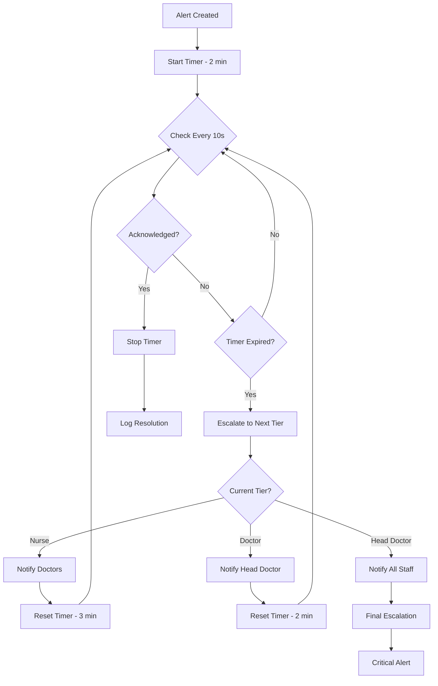
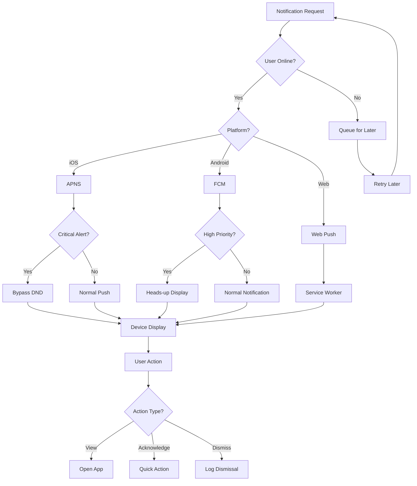
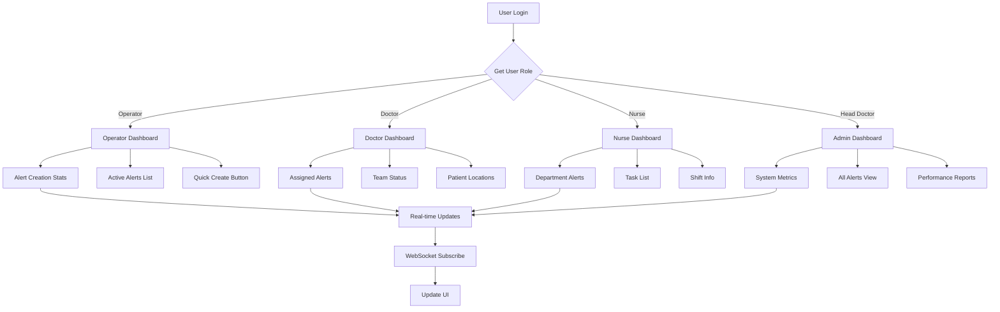

# 📱 Module-wise Sprint Planning with Mobile Focus

## 🎯 Sprint Overview

### Current Status
- **Sprint**: Week 1-2 (Foundation)
- **Progress**: 15% Overall
- **Focus**: Database schema & role system implementation

### Sprint Timeline
```
Week 1-2: Foundation & Auth Module ← Current
Week 3-4: Alert Module & Dashboard Module
Week 5-6: Escalation Module & Notification Module
Week 7-8: Integration, Testing & Polish
```

---

## 📋 Module 1: Authentication Module (Week 1-2)

### 🎯 Sprint Goals
- Complete healthcare role system
- Profile completion with hospital fields
- Multi-device session management

### 📱 Mobile-Specific Tasks

#### iOS Tasks
```yaml
Sprint 1.1: iOS Authentication
Tasks:
  1. Biometric Authentication:
     - [ ] Face ID integration
     - [ ] Touch ID fallback
     - [ ] Keychain storage
     Time: 4 hours
     
  2. OAuth Implementation:
     - [ ] ASWebAuthenticationSession setup
     - [ ] Google Sign-In SDK
     - [ ] Redirect handling
     Time: 6 hours
     
  3. Session Persistence:
     - [ ] Keychain wrapper
     - [ ] Token refresh logic
     - [ ] Background refresh
     Time: 4 hours
```

#### Android Tasks
```yaml
Sprint 1.2: Android Authentication
Tasks:
  1. Biometric Authentication:
     - [ ] Fingerprint API
     - [ ] BiometricPrompt
     - [ ] Encrypted SharedPreferences
     Time: 4 hours
     
  2. OAuth Implementation:
     - [ ] Chrome Custom Tabs
     - [ ] Google Sign-In integration
     - [ ] Deep link handling
     Time: 6 hours
     
  3. Session Management:
     - [ ] EncryptedSharedPreferences
     - [ ] WorkManager for refresh
     - [ ] Account sync
     Time: 4 hours
```

#### Web Tasks
```yaml
Sprint 1.3: Web Authentication
Tasks:
  1. OAuth Flow:
     - [ ] Popup/redirect handling
     - [ ] PKCE implementation
     - [ ] Silent refresh
     Time: 4 hours
     
  2. Session Storage:
     - [ ] IndexedDB for tokens
     - [ ] Service Worker cache
     - [ ] Tab synchronization
     Time: 3 hours
```

### 🔄 Submodule Flow Diagram


---

## 📋 Module 2: Alert Management Module (Week 3-4)

### 🎯 Sprint Goals
- Alert creation form with validation
- Real-time alert dashboard
- Acknowledgment system

### 📱 Mobile-Specific Tasks

#### iOS Tasks
```yaml
Sprint 2.1: iOS Alert Features
Tasks:
  1. Alert Creation UI:
     - [ ] Large touch targets (44px min)
     - [ ] Haptic feedback
     - [ ] Voice input support
     - [ ] Keyboard optimization
     Time: 6 hours
     
  2. Alert Reception:
     - [ ] Critical alert sounds
     - [ ] 3D Touch actions
     - [ ] Widget extension
     - [ ] Siri shortcuts
     Time: 8 hours
     
  3. Performance:
     - [ ] Image caching
     - [ ] Lazy loading
     - [ ] Background fetch
     Time: 4 hours
```

#### Android Tasks
```yaml
Sprint 2.2: Android Alert Features
Tasks:
  1. Alert Creation UI:
     - [ ] Material Design 3
     - [ ] Accessibility support
     - [ ] Voice actions
     - [ ] Quick tiles
     Time: 6 hours
     
  2. Alert Reception:
     - [ ] Notification channels
     - [ ] Direct reply actions
     - [ ] Bubbles API
     - [ ] App shortcuts
     Time: 8 hours
     
  3. Performance:
     - [ ] RecyclerView optimization
     - [ ] Glide image loading
     - [ ] Coroutines for async
     Time: 4 hours
```

### 🔄 Submodule Flow Diagram


---

## 📋 Module 3: Escalation Engine Module (Week 5-6)

### 🎯 Sprint Goals
- Timer-based escalation system
- Multi-tier notification logic
- Escalation tracking

### 📱 Mobile-Specific Tasks

#### Background Processing
```yaml
Sprint 3.1: Mobile Background Tasks
iOS:
  - [ ] Background Task API
  - [ ] Silent push for timers
  - [ ] Background fetch
  Time: 8 hours
  
Android:
  - [ ] WorkManager setup
  - [ ] Foreground Service
  - [ ] AlarmManager backup
  Time: 8 hours
  
Cross-Platform:
  - [ ] Expo BackgroundFetch
  - [ ] Expo TaskManager
  - [ ] State persistence
  Time: 6 hours
```

### 🔄 Escalation Flow Diagram


---

## 📋 Module 4: Notification Module (Week 5-6)

### 🎯 Sprint Goals
- Push notification setup
- Real-time WebSocket updates
- Multi-channel delivery

### 📱 Mobile-Specific Tasks

#### Push Notification Setup
```yaml
Sprint 4.1: Push Notifications
iOS:
  1. Critical Alerts:
     - [ ] Special entitlement request
     - [ ] Custom sound files
     - [ ] Rich notifications
     - [ ] Notification Service Extension
     Time: 10 hours
     
  2. Categories & Actions:
     - [ ] Acknowledge action
     - [ ] Snooze action
     - [ ] Quick reply
     Time: 4 hours
     
Android:
  1. High Priority Channel:
     - [ ] Channel configuration
     - [ ] Custom sounds
     - [ ] Full-screen intent
     - [ ] Direct boot aware
     Time: 8 hours
     
  2. Actions & Replies:
     - [ ] Action buttons
     - [ ] Direct reply
     - [ ] Smart replies
     Time: 4 hours
```

### 🔄 Notification Flow Diagram


---

## 📋 Module 5: Dashboard Module (Week 3-4)

### 🎯 Sprint Goals
- Role-specific dashboards
- Real-time metrics
- Performance optimization

### 📱 Mobile-Specific Tasks

#### Mobile UI Optimization
```yaml
Sprint 5.1: Dashboard Optimization
All Platforms:
  1. Performance:
     - [ ] Virtual scrolling
     - [ ] Lazy loading
     - [ ] Image optimization
     - [ ] Skeleton screens
     Time: 8 hours
     
  2. Real-time Updates:
     - [ ] WebSocket management
     - [ ] Optimistic updates
     - [ ] Offline queue
     Time: 6 hours
     
  3. Responsive Design:
     - [ ] Tablet layouts
     - [ ] Landscape mode
     - [ ] Foldable support
     Time: 4 hours
```

### 🔄 Dashboard Flow Diagram


---

## 📊 Sprint Velocity & Tracking

### Week-by-Week Breakdown

#### Week 1-2 (Current)
```yaml
Planned: 80 hours
Modules:
  - Auth Module: 40 hours
  - Database Setup: 20 hours
  - Project Setup: 20 hours
  
Progress: 30%
Blockers: None
```

#### Week 3-4
```yaml
Planned: 80 hours
Modules:
  - Alert Module: 40 hours
  - Dashboard Module: 40 hours
  
Dependencies:
  - Auth system complete
  - Database schema ready
```

#### Week 5-6
```yaml
Planned: 80 hours
Modules:
  - Escalation Module: 40 hours
  - Notification Module: 40 hours
  
Dependencies:
  - Alert system working
  - WebSocket setup
```

#### Week 7-8
```yaml
Planned: 80 hours
Tasks:
  - Integration Testing: 30 hours
  - Performance Optimization: 20 hours
  - Bug Fixes: 20 hours
  - Documentation: 10 hours
```

---

## 🎯 Definition of Done

### For Each Module:
- [ ] All submodules implemented
- [ ] Unit tests written (>80% coverage)
- [ ] Integration tests passing
- [ ] Cross-platform testing complete
- [ ] Performance benchmarks met
- [ ] Documentation updated
- [ ] Code reviewed and approved
- [ ] Deployed to staging

### Mobile-Specific Criteria:
- [ ] Works offline with queue
- [ ] Handles network transitions
- [ ] Battery efficient
- [ ] Accessibility compliant
- [ ] Platform UI guidelines followed
- [ ] Push notifications working
- [ ] Background tasks functional
- [ ] App size optimized

---

## 📱 Platform-Specific Considerations

### iOS Specific
- Request critical alert entitlement early
- Implement proper background modes
- Handle App Store review requirements
- Support latest iOS features

### Android Specific
- Handle Doze mode and App Standby
- Implement proper foreground services
- Support different Android versions
- Handle manufacturer customizations

### Web Specific
- Progressive Web App features
- Service Worker for offline
- Responsive design for all screens
- Browser compatibility

---

## 🚀 Next Steps

1. **Immediate (This Week)**:
   - Complete auth module mobile tasks
   - Finalize database schema
   - Set up push notification infrastructure
   
2. **Next Sprint (Week 3-4)**:
   - Begin alert module implementation
   - Start dashboard development
   - Initial WebSocket setup
   
3. **Continuous**:
   - Daily standups on progress
   - Update sprint board
   - Address blockers immediately
   - Test on real devices

---

*Sprint Planning Version: 1.0*  
*Last Updated: January 8, 2025*  
*Next Review: End of Week 2*