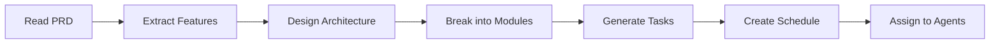
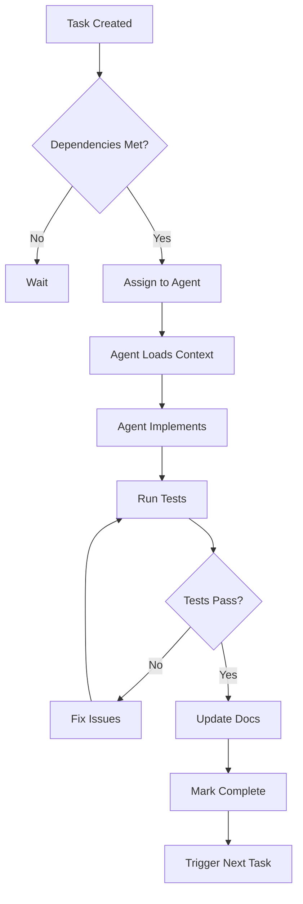

# 🔄 Agent Workflow Automation Guide

*Last Updated: June 6, 2025*

## 🎯 Overview

This guide explains how the multi-agent system automatically processes tasks and builds applications from PRD to production.

## 🤖 Automated Workflows

### 1. PRD Processing Workflow

When you provide a PRD, the Manager Agent automatically:



### 2. Task Execution Workflow

Each task follows this automated flow:



## 📋 Agent Communication Protocol

### Manager → Developer
```yaml
Command: "Execute TASK-001"
Payload:
  task:
    id: TASK-001
    title: "Implement user authentication"
    module: "auth"
    type: "backend"
  context:
    relatedFiles:
      - src/server/routers/auth.ts
      - lib/auth/auth.ts
    patterns:
      - "Use Better Auth for authentication"
      - "Follow existing tRPC patterns"
    dependencies:
      - "Database schema must be ready"
  requirements:
    - "Email/password login"
    - "OAuth with Google"
    - "Session management"
    - "80% test coverage"
```

### Developer → Manager
```yaml
Response: "TASK-001 Complete"
Payload:
  status: "completed"
  changes:
    filesCreated:
      - src/server/routers/auth.ts
    filesModified:
      - src/db/schema.ts
    testsAdded:
      - __tests__/unit/auth.test.ts
  metrics:
    linesOfCode: 245
    testCoverage: 85%
    timeSpent: "2.5 hours"
  notes: "Added rate limiting to login endpoint"
```

## 🔄 Parallel Execution

The system automatically identifies tasks that can run in parallel:

### Example Parallel Execution
```
Sprint 1:
├── Parallel Group 1 (No dependencies)
│   ├── TASK-001: Setup authentication (Backend)
│   ├── TASK-002: Create UI components (Frontend)
│   └── TASK-003: Setup testing framework (Tester)
├── Parallel Group 2 (Depends on Group 1)
│   ├── TASK-004: Login screen (Frontend)
│   └── TASK-005: Auth API tests (Tester)
└── Sequential (Depends on all above)
    └── TASK-006: Integration testing (Tester)
```

## 🎨 Automatic Code Generation

### Component Generation
When creating a new component, the Frontend Agent:
1. Analyzes design requirements
2. Selects appropriate universal components
3. Generates TypeScript component
4. Adds proper typing
5. Implements responsive design
6. Creates tests

### API Endpoint Generation
When creating an endpoint, the Backend Agent:
1. Analyzes data requirements
2. Creates Zod schemas
3. Generates tRPC procedure
4. Implements business logic
5. Adds authorization
6. Creates tests

## 📊 Progress Tracking

### Real-Time Status Updates
```typescript
interface ProjectStatus {
  phase: 'planning' | 'development' | 'testing' | 'deployment';
  progress: {
    total: number;
    completed: number;
    inProgress: number;
    blocked: number;
  };
  currentSprint: {
    number: number;
    startDate: Date;
    endDate: Date;
    velocity: number;
  };
  risks: Risk[];
  nextMilestone: {
    name: string;
    date: Date;
    tasksRemaining: number;
  };
}
```

### Automatic Reporting
Every day at completion, the Manager generates:
- Sprint progress report
- Blocker identification
- Risk assessment
- Timeline adjustment
- Resource utilization

## 🚦 Decision Making

### Automatic Decisions
The system makes these decisions automatically:
- Task prioritization based on dependencies
- Agent assignment based on expertise
- Parallel execution opportunities
- Test coverage requirements
- Code review triggers

### Human Intervention Points
The system requests human input for:
- Ambiguous requirements
- Architecture decisions
- Breaking changes
- Security concerns
- Performance trade-offs

## 🔧 Customization

### Workflow Rules
You can customize the workflow by modifying:
```yaml
workflow:
  rules:
    minTestCoverage: 80
    codeReviewRequired: true
    documentationRequired: true
    parallelTaskLimit: 3
    
  agentBehavior:
    backend:
      preferredPatterns: ["tRPC", "Drizzle"]
      testFramework: "Jest"
    frontend:
      componentLibrary: "universal"
      stateManagement: "Zustand"
```

### Custom Workflows
Create custom workflows for specific project types:
```yaml
projectType: "ecommerce"
workflow:
  phases:
    - name: "MVP"
      focus: ["auth", "products", "cart"]
    - name: "Payment"
      focus: ["checkout", "orders"]
    - name: "Scale"
      focus: ["performance", "analytics"]
```

## 🎯 Example: Building a Todo App

### 1. PRD Input
```markdown
# Todo App
- User can create, edit, delete todos
- User can mark todos complete
- Todos sync across devices
- Support offline mode
```

### 2. Automatic Task Generation
```
TASK-001: Setup authentication (Backend)
TASK-002: Create todo schema (Backend)
TASK-003: Create todo CRUD API (Backend)
TASK-004: Create todo components (Frontend)
TASK-005: Create todo screens (Frontend)
TASK-006: Implement offline sync (Full-stack)
TASK-007: Write tests (Tester)
```

### 3. Execution Timeline
```
Day 1: TASK-001, TASK-002 (parallel)
Day 2: TASK-003, TASK-004 (parallel)
Day 3: TASK-005
Day 4: TASK-006
Day 5: TASK-007
```

## 🔍 Monitoring Commands

### Check Status
```
Manager, what's the current status?
Manager, show blockers
Manager, estimate completion date
```

### Debug Issues
```
Manager, why is TASK-005 blocked?
Manager, show TASK-003 implementation
Manager, run tests for auth module
```

### Generate Reports
```
Manager, generate sprint report
Manager, show velocity trends
Manager, list completed features
```

## 🚀 Best Practices

1. **Clear PRD**: The better your PRD, the better the output
2. **Modular Design**: Break features into independent modules
3. **Test Early**: Include test requirements in PRD
4. **Regular Reviews**: Check progress daily
5. **Iterative Development**: Start with MVP, then enhance

---

*This automation system enables rapid, high-quality application development with minimal human intervention.*