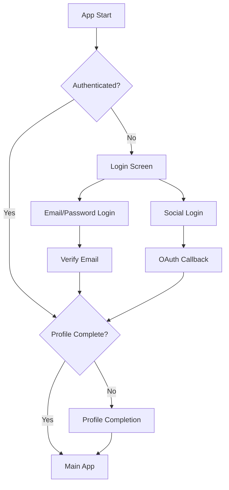

# Authentication Flow Architecture

Last Updated: January 15, 2025

## Overview

The authentication system uses a block-based architecture with dedicated components for each auth flow. All auth-related UI components are organized as blocks in `/components/blocks/auth/`.

## Current Architecture

### Auth Screens (app/(auth)/)

These are the route screens that use auth blocks:

1. **login.tsx** - Sign in screen
2. **register.tsx** - Registration screen  
3. **forgot-password.tsx** - Password reset screen
4. **verify-email.tsx** - Email verification screen
5. **complete-profile.tsx** - Profile completion screen

### Auth Blocks (components/blocks/auth/)

Reusable auth components:

1. **GoogleSignIn** ✅ - OAuth sign-in button
   - Responsive sizing
   - Animated interactions
   - Haptic feedback

2. **ProfileCompletion** ✅ - Multi-step profile setup
   - Progress animations
   - Form validation
   - Role selection integration

3. **ProtectedRoute** ✅ - Route protection wrapper
   - Auth state checking
   - Redirect logic

### Planned Auth Blocks

These components need to be extracted from app screens:

1. **SignIn** - Login form component
   - Email/password inputs
   - Validation
   - Remember me option
   - Social login integration

2. **Register** - Registration form
   - Multi-step registration
   - Password strength indicator
   - Terms acceptance

3. **ForgotPassword** - Password reset form
   - Email input
   - Success/error states

4. **VerifyEmail** - Email verification
   - Code input
   - Resend functionality
   - Timer component

5. **Common Auth Components**:
   - **AuthCard** - Responsive auth wrapper with consistent styling
   - **AuthFormField** - Form field with icon and validation
   - **SocialLoginButtons** - Group of social login options
   - **PasswordStrengthIndicator** - Visual password requirements
   - **TermsFooter** - Terms and privacy links

## Authentication Flow



## Implementation Guidelines

### 1. Block Structure

Each auth block should follow this structure:

```
blocks/auth/ComponentName/
├── ComponentName.tsx      # Main component
├── useComponentName.ts    # Business logic hook
├── types.ts              # TypeScript interfaces
└── index.tsx             # Barrel export
```

### 2. Common Patterns

#### Form Validation
```tsx
// Use zod schemas
const loginSchema = z.object({
  email: z.string().email(),
  password: z.string().min(8),
});

// Use react-hook-form
const form = useForm({
  resolver: zodResolver(loginSchema),
});
```

#### Responsive Design
```tsx
const { isMobile } = useResponsive();
const size = isMobile ? 'lg' : 'md';
```

#### Animations
```tsx
import Animated, { FadeIn, SlideInRight } from 'react-native-reanimated';

<AnimatedView entering={FadeIn.springify()}>
  {/* Content */}
</AnimatedView>
```

### 3. State Management

Auth state is managed by:
- **useAuth hook** - Current user state
- **auth-store** - Zustand store for auth data
- **tRPC queries** - Server state synchronization

### 4. Security Considerations

- Never store passwords in state
- Use secure storage for tokens
- Implement proper CSRF protection
- Validate all inputs on both client and server
- Use HTTPS for all auth requests

## Migration Status

| Component | Current Location | Block Status | Migration Status |
|-----------|-----------------|--------------|------------------|
| Login Form | app/(auth)/login.tsx | ❌ | Needs extraction |
| Register Form | app/(auth)/register.tsx | ❌ | Needs extraction |
| Forgot Password | app/(auth)/forgot-password.tsx | ❌ | Needs extraction |
| Email Verification | app/(auth)/verify-email.tsx | ❌ | Needs extraction + theme migration |
| Profile Completion | components/blocks/auth/ProfileCompletion | ✅ | Complete |
| Google Sign In | components/blocks/auth/GoogleSignIn | ✅ | Complete |
| Protected Route | components/blocks/auth/ProtectedRoute | ✅ | Complete |

## Next Steps

1. Extract login form logic into SignIn block
2. Extract registration form into Register block
3. Create common auth components (AuthCard, AuthFormField)
4. Migrate verify-email.tsx to use universal components
5. Create comprehensive auth block documentation
6. Add auth flow E2E tests