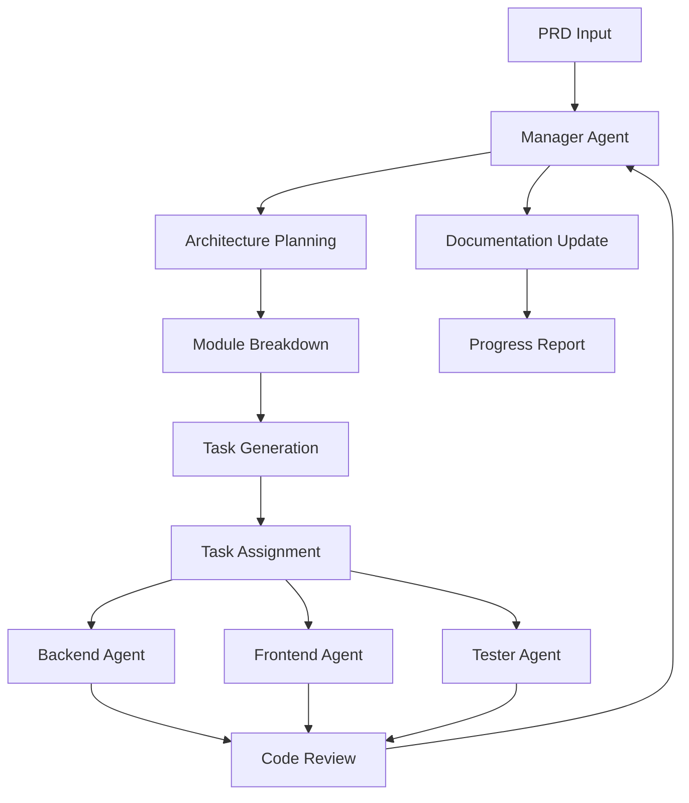

# 🤖 Multi-Agent Workflow System Architecture

*Version: 1.0.0 | Last Updated: June 6, 2025*

## 🎯 System Overview

This document defines the complete multi-agent workflow system for developing applications using this starter kit. The system is designed to take a Product Requirements Document (PRD) and automatically coordinate multiple AI agents to build a complete, production-ready application.

## 🏗️ System Architecture



## 📋 PRD Processing Workflow

### 1. PRD Input Structure
When you provide a PRD, save it in the following location:
```
docs/projects/[project-name]/
├── PRD.md                 # Main product requirements
├── user-stories.md        # User stories breakdown
├── technical-specs.md     # Technical specifications
├── design-mockups/        # UI/UX designs
└── acceptance-criteria.md # Success metrics
```

### 2. Manager Agent Processing

#### Phase 1: PRD Analysis
```typescript
// Manager reads PRD and extracts:
interface PRDAnalysis {
  projectName: string;
  projectType: 'web' | 'mobile' | 'full-stack';
  features: Feature[];
  userRoles: UserRole[];
  integrations: Integration[];
  constraints: Constraint[];
  timeline: Timeline;
}
```

#### Phase 2: Architecture Planning
```typescript
// Manager creates architecture based on PRD:
interface ArchitecturePlan {
  frontend: {
    screens: Screen[];
    components: Component[];
    navigation: NavigationFlow;
    stateManagement: StateRequirements;
  };
  backend: {
    entities: Entity[];
    endpoints: Endpoint[];
    authentication: AuthRequirements;
    integrations: ExternalService[];
  };
  infrastructure: {
    database: DatabaseSchema;
    deployment: DeploymentPlan;
    monitoring: MonitoringSetup;
  };
}
```

#### Phase 3: Module Breakdown
```typescript
// Convert features to modules:
interface Module {
  id: string;
  name: string;
  type: 'feature' | 'core' | 'shared';
  dependencies: string[];
  tasks: Task[];
  estimatedHours: number;
  priority: 'critical' | 'high' | 'medium' | 'low';
}
```

#### Phase 4: Task Generation
```typescript
// Generate specific tasks for each module:
interface Task {
  id: string;
  moduleId: string;
  title: string;
  description: string;
  type: 'backend' | 'frontend' | 'fullstack' | 'testing';
  assignedTo: AgentType;
  dependencies: string[];
  acceptanceCriteria: string[];
  estimatedHours: number;
  files: string[];
  testRequirements: TestRequirement[];
}
```

## 🔄 Automated Agent Workflow

### 1. Task Assignment Algorithm
```python
def assign_task(task: Task) -> Agent:
    # Priority-based assignment
    if task.type == 'backend':
        return BackendAgent if BackendAgent.available else queue
    elif task.type == 'frontend':
        return FrontendAgent if FrontendAgent.available else queue
    elif task.type == 'fullstack':
        # Assign to least loaded agent
        return min(BackendAgent, FrontendAgent, key=lambda a: a.workload)
    elif task.type == 'testing':
        return TesterAgent
```

### 2. Agent Communication Protocol

#### Task Handoff
```yaml
Manager → Developer:
  - task_id: TASK-001
  - context:
      - module_overview
      - related_files
      - design_patterns
      - dependencies
  - requirements:
      - acceptance_criteria
      - test_coverage
      - documentation

Developer → Manager:
  - task_id: TASK-001
  - status: completed
  - changes:
      - files_modified: []
      - tests_added: []
      - documentation_updated: []
  - notes: "Implementation details"
```

#### Code Review Process
```yaml
Developer → Tester:
  - task_id: TASK-001
  - implementation:
      - files_changed
      - test_coverage
      - edge_cases

Tester → Manager:
  - task_id: TASK-001
  - test_results:
      - passed: []
      - failed: []
      - coverage: 85%
  - recommendations: []
```

### 3. Parallel Execution Strategy

```typescript
// Manager orchestrates parallel work:
class TaskOrchestrator {
  async executeTasks(tasks: Task[]) {
    // Group independent tasks
    const taskGroups = this.groupByDependencies(tasks);
    
    for (const group of taskGroups) {
      // Execute tasks in parallel within group
      await Promise.all(
        group.map(task => this.assignAndExecute(task))
      );
    }
  }
  
  private groupByDependencies(tasks: Task[]): Task[][] {
    // Topological sort to identify parallel groups
    return topologicalSort(tasks);
  }
}
```

## 📁 Project Structure Generation

### For Each New Project
```
my-expo/
├── apps/
│   └── [project-name]/
│       ├── features/          # Feature modules
│       ├── screens/          # App screens
│       ├── services/         # Business logic
│       └── tests/           # Project tests
├── packages/
│   └── [project-name]-shared/  # Shared code
├── docs/
│   └── projects/
│       └── [project-name]/
│           ├── PRD.md
│           ├── architecture.md
│           ├── task-log.md
│           └── progress-reports/
```

## 🎯 Agent Behavior Specifications

### Manager Agent Behavior
```typescript
class ManagerAgent {
  async processPRD(prdPath: string) {
    // 1. Parse PRD
    const prd = await this.parsePRD(prdPath);
    
    // 2. Generate architecture
    const architecture = await this.planArchitecture(prd);
    
    // 3. Break into modules
    const modules = await this.createModules(architecture);
    
    // 4. Generate tasks
    const tasks = await this.generateTasks(modules);
    
    // 5. Create task schedule
    const schedule = await this.scheduleTask(tasks);
    
    // 6. Initialize project
    await this.initializeProject(prd.projectName);
    
    // 7. Start task execution
    await this.startExecution(schedule);
  }
  
  async handleStatusRequest() {
    return {
      currentSprint: this.getCurrentSprint(),
      tasksCompleted: this.getCompletedTasks(),
      tasksInProgress: this.getInProgressTasks(),
      blockers: this.getBlockers(),
      nextMilestone: this.getNextMilestone()
    };
  }
}
```

### Backend Developer Agent Behavior
```typescript
class BackendAgent {
  async executeTask(task: Task) {
    // 1. Load context
    const context = await this.loadContext(task);
    
    // 2. Analyze requirements
    const plan = await this.planImplementation(task, context);
    
    // 3. Implement
    for (const step of plan.steps) {
      await this.implementStep(step);
      await this.runTests(step);
    }
    
    // 4. Document
    await this.updateDocumentation(task);
    
    // 5. Report completion
    return this.reportCompletion(task);
  }
  
  private async implementStep(step: ImplementationStep) {
    // Follow patterns from starter kit
    if (step.type === 'api') {
      await this.createTRPCRouter(step);
    } else if (step.type === 'database') {
      await this.updateDrizzleSchema(step);
    } else if (step.type === 'service') {
      await this.createService(step);
    }
  }
}
```

### Frontend Developer Agent Behavior
```typescript
class FrontendAgent {
  async executeTask(task: Task) {
    // 1. Load design context
    const design = await this.loadDesign(task);
    
    // 2. Plan component structure
    const components = await this.planComponents(design);
    
    // 3. Implement
    for (const component of components) {
      await this.createComponent(component);
      await this.addToScreen(component);
      await this.testComponent(component);
    }
    
    // 4. Ensure responsive
    await this.testResponsive(task);
    
    // 5. Report completion
    return this.reportCompletion(task);
  }
  
  private async createComponent(spec: ComponentSpec) {
    // Use Universal Design System
    const template = this.getComponentTemplate(spec.type);
    const component = this.generateComponent(template, spec);
    await this.writeComponent(component);
  }
}
```

### Tester Agent Behavior
```typescript
class TesterAgent {
  async testTask(task: Task) {
    // 1. Generate test plan
    const testPlan = await this.createTestPlan(task);
    
    // 2. Execute tests
    const results = await this.executeTests(testPlan);
    
    // 3. Check coverage
    const coverage = await this.checkCoverage(task.files);
    
    // 4. Identify edge cases
    const edgeCases = await this.findEdgeCases(task);
    
    // 5. Report results
    return {
      passed: results.passed,
      failed: results.failed,
      coverage: coverage,
      recommendations: this.generateRecommendations(results)
    };
  }
}
```

## 📊 Progress Tracking System

### Task States
```typescript
enum TaskState {
  PENDING = 'pending',
  ASSIGNED = 'assigned',
  IN_PROGRESS = 'in_progress',
  IN_REVIEW = 'in_review',
  TESTING = 'testing',
  COMPLETED = 'completed',
  BLOCKED = 'blocked'
}
```

### Progress Metrics
```typescript
interface ProjectMetrics {
  totalTasks: number;
  completedTasks: number;
  inProgressTasks: number;
  blockedTasks: number;
  velocity: number; // tasks per day
  estimatedCompletion: Date;
  testCoverage: number;
  codeQuality: number;
}
```

## 🚀 Getting Started with a New Project

### 1. Create PRD
```markdown
# Project: [Your App Name]

## Overview
Brief description of the application

## Target Users
- User Role 1: Description
- User Role 2: Description

## Core Features
1. Feature 1
   - User Story
   - Acceptance Criteria
2. Feature 2
   - User Story
   - Acceptance Criteria

## Technical Requirements
- Platform: iOS, Android, Web
- Authentication: Email, OAuth
- Database: PostgreSQL
- Integrations: List any

## Success Metrics
- Metric 1
- Metric 2
```

### 2. Save PRD
```bash
mkdir -p docs/projects/your-app-name
cp PRD.md docs/projects/your-app-name/
```

### 3. Invoke Manager
```
Manager, process PRD at docs/projects/your-app-name/PRD.md
```

### 4. Monitor Progress
```
Manager, show project status
```

## 🔧 Configuration

### Agent Capabilities
```yaml
agents:
  manager:
    capabilities:
      - prd_analysis
      - architecture_planning
      - task_management
      - documentation
      - code_review
    
  backend:
    capabilities:
      - trpc_development
      - database_design
      - authentication
      - api_integration
      - testing
    
  frontend:
    capabilities:
      - react_native
      - responsive_design
      - state_management
      - component_development
      - testing
    
  tester:
    capabilities:
      - unit_testing
      - integration_testing
      - e2e_testing
      - performance_testing
      - security_testing
```

### Workflow Rules
```yaml
rules:
  - name: dependency_order
    description: Tasks must be executed in dependency order
    
  - name: test_coverage
    description: All code must have >80% test coverage
    
  - name: documentation
    description: All features must be documented
    
  - name: code_review
    description: All code must pass review before merge
    
  - name: responsive_design
    description: All UI must work on mobile, tablet, desktop
```

## 📈 Best Practices Integration

### 1. Code Quality Standards
- TypeScript strict mode
- ESLint + Prettier
- Conventional commits
- PR reviews

### 2. Testing Standards
- Unit tests for logic
- Integration tests for APIs
- E2E tests for critical flows
- Performance benchmarks

### 3. Documentation Standards
- API documentation
- Component documentation
- Architecture decisions
- User guides

### 4. Security Standards
- Input validation
- Authentication checks
- Rate limiting
- Audit logging

## 🔄 Continuous Improvement

### Feedback Loop
```
Development → Testing → Review → Documentation → Retrospective
     ↑                                                    ↓
     ←←←←←←←←←← Learning & Optimization ←←←←←←←←←←←←←←←←
```

### Metrics Collection
- Task completion time
- Bug rates
- Code quality scores
- Test coverage trends
- Documentation completeness

### Agent Training
- Collect successful patterns
- Update best practices
- Improve estimation accuracy
- Enhance communication protocols

---

*This system enables fully automated application development from PRD to production, with consistent quality and best practices.*