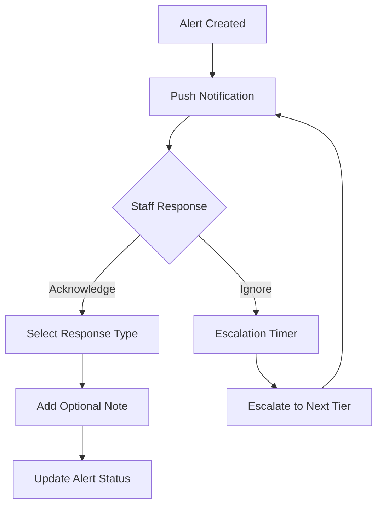

# Hospital Alert System - Complete Implementation Plan

**Version**: 1.0.0  
**Date**: January 11, 2025  
**Status**: Ready for Implementation

## Overview

This document outlines the complete implementation plan for the Hospital Alert System, focusing on role-specific UX, acknowledgment tracking, and real-time features.

## 1. Alert Acknowledgment System

### 1.1 Acknowledgment Types
- **Responding**: Medical staff is going to the location
- **Acknowledged**: Aware of alert but someone else is responding
- **Unable to Respond**: Cannot respond, pass to next tier
- **Taking Over**: Senior staff assuming responsibility
- **Resolved**: Alert has been handled

### 1.2 Acknowledgment Flow


### 1.3 Data Model
```typescript
interface AlertAcknowledgment {
  id: string;
  alertId: string;
  userId: string;
  userName: string;
  userRole: 'doctor' | 'nurse' | 'head_doctor';
  type: 'responding' | 'acknowledged' | 'unable' | 'taking_over' | 'resolved';
  note?: string;
  timestamp: Date;
  responseTimeSeconds: number;
}

interface AlertTimeline {
  alertId: string;
  events: Array<{
    type: 'created' | 'sent' | 'acknowledged' | 'escalated' | 'resolved';
    timestamp: Date;
    userId?: string;
    details: string;
    metadata?: any;
  }>;
}
```

## 2. Screens Implementation

### 2.1 Healthcare Section Screens

#### **(healthcare)/escalation-queue.tsx**
**Purpose**: Monitor and manage alerts in escalation
**Key Features**:
- Real-time escalation countdown timers
- Quick acknowledge from queue
- Visual urgency indicators
- Filter by escalation level

#### **(healthcare)/alert-history.tsx**
**Purpose**: Historical view and analytics
**Key Features**:
- Date range filtering
- Export to CSV/PDF
- Search by patient/room/type
- Response time analytics
- Acknowledgment rate metrics

#### **(healthcare)/shift-handover.tsx**
**Purpose**: Shift change management
**Key Features**:
- Active alerts summary
- Unacknowledged alerts highlight
- Team availability status
- Notes for incoming shift
- Quick bulk acknowledgment

#### **(healthcare)/response-analytics.tsx**
**Purpose**: Performance metrics dashboard
**Key Features**:
- Average response times by role
- Peak alert times
- Escalation frequency
- Staff performance metrics

### 2.2 Modal Screens

#### **(modals)/alert-details.tsx**
**Purpose**: Comprehensive alert information
**Key Features**:
- Full alert timeline
- All acknowledgments list
- Patient information
- Location map
- Quick actions

#### **(modals)/acknowledge-alert.tsx**
**Purpose**: Acknowledge with context
**Key Features**:
- Response type selection
- Optional note field
- ETA selection
- Delegate to colleague
- Voice note option

#### **(modals)/escalation-details.tsx**
**Purpose**: View escalation chain
**Key Features**:
- Visual escalation tree
- Time at each level
- Skip escalation option (admin)
- Contact next tier directly

## 3. Blocks Implementation

### 3.1 Core Healthcare Blocks

#### **EscalationQueueBlock**
```typescript
interface EscalationQueueBlockProps {
  maxItems?: number;
  autoRefresh?: boolean;
  showCountdown?: boolean;
}
```
Features:
- Live countdown timers
- Color-coded urgency
- Quick acknowledge buttons
- Escalation level badges

#### **AlertHistoryBlock**
```typescript
interface AlertHistoryBlockProps {
  timeRange?: 'today' | 'week' | 'month';
  maxItems?: number;
  showStats?: boolean;
}
```
Features:
- Compact history view
- Status indicators
- Response time display
- Filter presets

#### **ShiftOverviewBlock**
```typescript
interface ShiftOverviewBlockProps {
  showStaffList?: boolean;
  showActiveAlerts?: boolean;
  showMetrics?: boolean;
}
```
Features:
- Current shift staff
- Coverage gaps
- Active alert count
- Handover notes

#### **ResponseMetricsBlock**
```typescript
interface ResponseMetricsBlockProps {
  period?: 'shift' | 'day' | 'week';
  showTrends?: boolean;
  compareToAverage?: boolean;
}
```
Features:
- KPI cards
- Trend charts
- Comparison to targets
- Drill-down capability

#### **AlertTimelineBlock**
```typescript
interface AlertTimelineBlockProps {
  alertId: string;
  showFullDetails?: boolean;
  highlightEscalations?: boolean;
}
```
Features:
- Vertical timeline
- Status changes
- User avatars
- Time between events

#### **QuickAlertCreationBlock** (Operator Only)
```typescript
interface QuickAlertCreationBlockProps {
  presetAlerts?: AlertPreset[];
  showRecent?: boolean;
}
```
Features:
- One-tap common alerts
- Recent locations
- Favorite alerts
- Voice input

#### **TeamStatusBlock**
```typescript
interface TeamStatusBlockProps {
  department?: string;
  showAvailability?: boolean;
  showResponseTimes?: boolean;
}
```
Features:
- Online/offline status
- Current alert load
- Average response time
- Contact quick actions

#### **CriticalAlertsBlock**
```typescript
interface CriticalAlertsBlockProps {
  urgencyThreshold?: number;
  showOnlyUnacknowledged?: boolean;
  enableSound?: boolean;
}
```
Features:
- Critical only filter
- Pulsing animations
- Sound alerts
- Immediate acknowledge

## 4. UX Guidelines by Role

### 4.1 Operator UX
- **Primary Color**: Blue (#3B82F6)
- **Focus**: Speed and efficiency
- **Key Elements**:
  - Large touch targets (min 48px)
  - 2-3 tap maximum to send alert
  - Visual feedback for every action
  - Preset templates for common alerts
  - Real-time delivery confirmation

### 4.2 Medical Staff UX (Doctor/Nurse)
- **Primary Color**: Green (#10B981)
- **Focus**: Clarity and quick response
- **Key Elements**:
  - Full-screen critical alerts
  - One-tap acknowledgment
  - Clear patient location
  - Minimal cognitive load
  - Glanceable information

### 4.3 Head Doctor UX
- **Primary Color**: Purple (#8B5CF6)
- **Focus**: Overview and control
- **Key Elements**:
  - Dashboard overview
  - Team performance metrics
  - Override capabilities
  - Bulk actions
  - Historical analytics

## 5. Visual Design System

### 5.1 Alert Priority Colors
```typescript
const alertColors = {
  critical: '#EF4444',    // Red
  high: '#F97316',       // Orange  
  medium: '#F59E0B',     // Amber
  low: '#3B82F6',        // Blue
  info: '#6B7280',       // Gray
};
```

### 5.2 Status Indicators
```typescript
const statusColors = {
  active: '#EF4444',      // Red pulse
  acknowledged: '#F59E0B', // Amber
  responding: '#3B82F6',   // Blue
  resolved: '#10B981',     // Green
  escalated: '#8B5CF6',    // Purple pulse
};
```

### 5.3 Animation Guidelines
- Critical alerts: Pulse animation
- Escalation: Slide up with bounce
- Acknowledgment: Scale + fade
- Success: Check mark draw
- Loading: Skeleton screens

## 6. Implementation Phases

### Phase 1: Foundation (Week 1)
1. Create acknowledgment data models
2. Implement core acknowledgment UI components
3. Set up WebSocket for real-time updates
4. Create alert timeline infrastructure

### Phase 2: Screens (Week 2)
1. Implement escalation-queue screen
2. Create alert-history with filters
3. Build shift-handover interface
4. Add response-analytics dashboard

### Phase 3: Blocks (Week 3)
1. Create all 8 healthcare blocks
2. Integrate with existing screens
3. Add real-time updates
4. Implement animations

### Phase 4: Polish (Week 4)
1. Role-specific UI refinements
2. Performance optimization
3. Accessibility audit
4. User testing feedback

## 7. Technical Considerations

### 7.1 Real-time Updates
- WebSocket connection for live updates
- Optimistic UI updates
- Offline queue for acknowledgments
- Conflict resolution for simultaneous actions

### 7.2 Performance
- Virtual lists for large datasets
- Lazy loading for historical data
- Image optimization for avatars
- Debounced search inputs

### 7.3 Accessibility
- VoiceOver/TalkBack support
- Minimum contrast ratios (WCAG AA)
- Keyboard navigation (web)
- Screen reader announcements

## 8. Testing Strategy

### 8.1 Unit Tests
- Acknowledgment logic
- Escalation timers
- Timeline generation
- Permission checks

### 8.2 Integration Tests
- Real-time updates
- Push notifications
- Data persistence
- API endpoints

### 8.3 E2E Tests
- Complete alert flow
- Multi-user scenarios
- Escalation chains
- Performance under load

## 9. Success Metrics

### 9.1 Technical Metrics
- Acknowledgment time < 2 minutes
- Screen load time < 1 second
- 99.9% notification delivery
- Zero data loss

### 9.2 User Metrics
- 90% acknowledgment rate
- < 20% escalation rate
- 95% user satisfaction
- < 30 min training time

## 10. Next Steps

1. Review and approve plan
2. Set up development environment
3. Create component library
4. Begin Phase 1 implementation
5. Weekly progress reviews

---

*This implementation plan is aligned with the Hospital Alert System PRD and focuses on delivering a user-friendly, reliable emergency response system.*