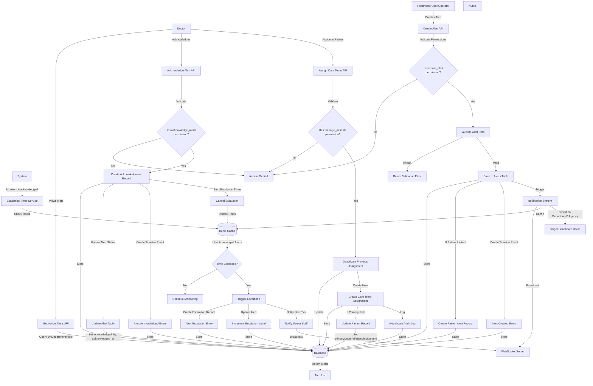
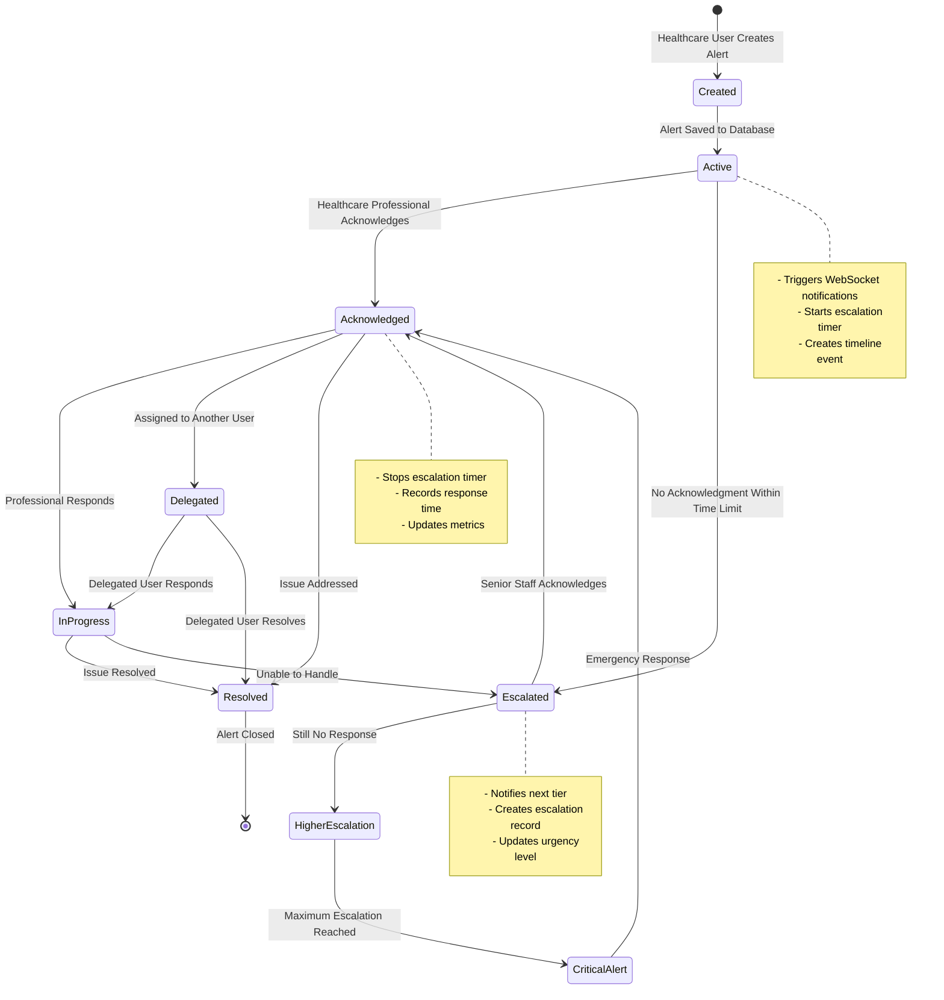
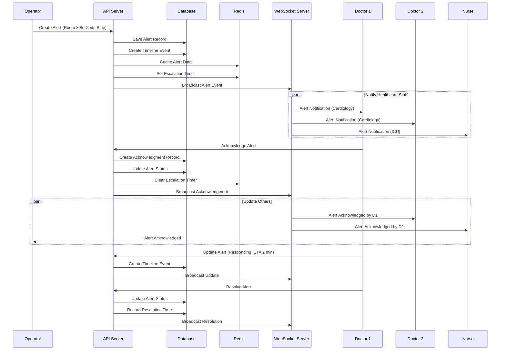
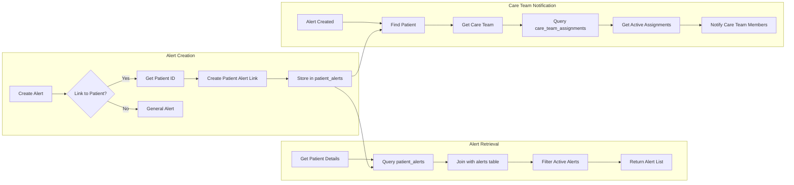
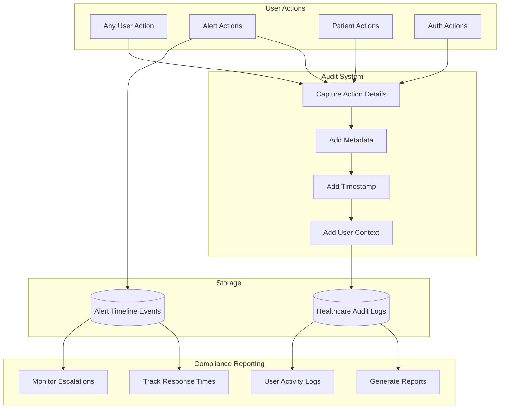

# Healthcare System Data Flow Diagrams

This document illustrates the data flow for key processes in the healthcare alert system.

## Alert Creation and Management Flow

## Alert Lifecycle State Machine

## Real-time Alert Distribution Flow

## Patient-Alert Association Flow

## Audit and Compliance Flow

## Key Data Flow Patterns

### 1. **Permission-Based Access**
- All operations check user permissions before execution
- Healthcare-specific permissions extend base user roles
- Department-based filtering for alerts

### 2. **Real-time Updates**
- WebSocket broadcasts for immediate notification
- Redis caching for performance
- Subscription-based updates for active users

### 3. **Escalation Management**
- Timer-based escalation using Redis
- Automatic tier progression
- Configurable escalation rules per alert type

### 4. **Audit Trail**
- Every action creates audit log entries
- Alert-specific timeline events
- Complete traceability for compliance

### 5. **Response Metrics**
- Automatic response time calculation
- Performance tracking per user/department
- Aggregated metrics for reporting