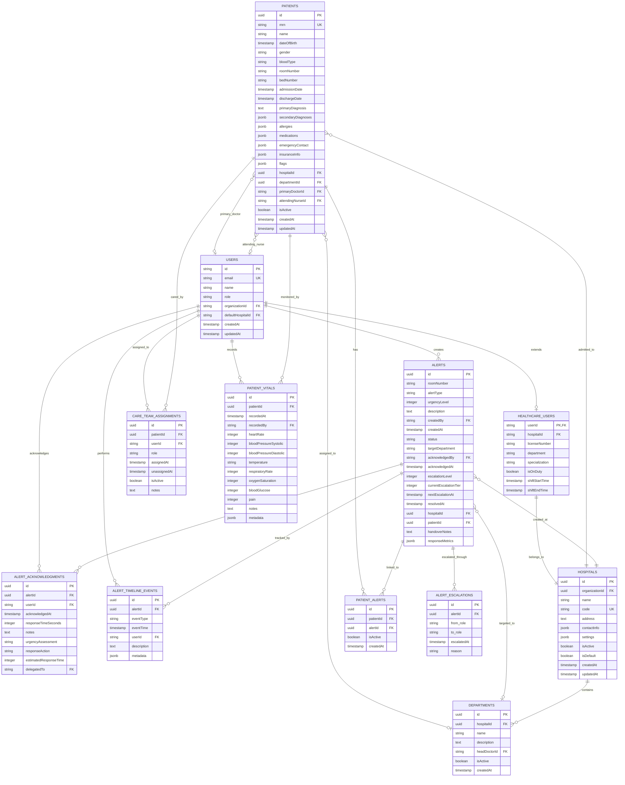

# Healthcare System Entity Relationship Diagram

This document illustrates the database schema relationships for the healthcare alert system.

## Entity Relationship Diagram

## Key Relationships

### 1. User Relationships
- **Users → Healthcare Users**: One-to-one extension relationship for medical-specific fields
- **Users → Patients**: 
  - One-to-many as primary doctor
  - One-to-many as attending nurse
- **Users → Care Team Assignments**: One-to-many (a user can be assigned to multiple patients)
- **Users → Alerts**: One-to-many (users create and acknowledge alerts)

### 2. Patient Relationships
- **Patients → Hospital**: Many-to-one (patients belong to a hospital)
- **Patients → Department**: Many-to-one optional (patients may be assigned to departments)
- **Patients → Care Team**: One-to-many (through care team assignments)
- **Patients → Alerts**: Many-to-many (through patient_alerts junction table)
- **Patients → Vitals**: One-to-many (continuous monitoring)

### 3. Alert Relationships
- **Alerts → Hospital**: Many-to-one (alerts are hospital-specific)
- **Alerts → Patients**: Many-to-many (an alert can involve multiple patients)
- **Alerts → Department**: Many-to-one optional (targeted to specific departments)
- **Alerts → Acknowledgments**: One-to-many (multiple acknowledgments possible)
- **Alerts → Timeline Events**: One-to-many (full lifecycle tracking)
- **Alerts → Escalations**: One-to-many (escalation history)

### 4. Hospital & Department Relationships
- **Hospital → Departments**: One-to-many
- **Hospital → Healthcare Users**: One-to-many
- **Hospital → Patients**: One-to-many

## Notable Design Patterns

1. **Junction Tables**: `patient_alerts` enables many-to-many relationships between patients and alerts
2. **Audit Trail**: `alert_timeline_events` and `healthcare_audit_logs` provide comprehensive tracking
3. **Soft Deletes**: Most entities use `isActive` flags rather than hard deletes
4. **JSON Fields**: Flexible storage for metadata, settings, and complex medical data
5. **Role-Based Access**: User roles and department assignments control access and routing

## Index Strategy
The schema includes strategic indexes on:
- Foreign key relationships
- Status and department combinations for alert queries
- Organization and default flags for hospital lookups
- Response action and delegation for acknowledgment queries