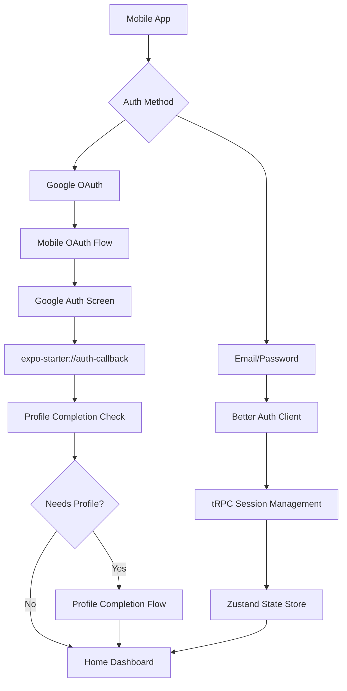

# 📱 Complete Mobile Authentication Guide

This guide covers the complete authentication flow for mobile platforms (iOS and Android) in the Full-Stack Expo Starter Kit.

## 🎯 Overview

The mobile authentication system supports:
- **Email/Password Authentication**: Standard login with secure validation
- **Google OAuth**: Social login with proper mobile handling
- **Profile Completion**: Guided onboarding for new users
- **Cross-Platform Compatibility**: Consistent experience on iOS and Android
- **Development Build Support**: Proper OAuth handling (not supported in Expo Go)

## 🔧 Mobile Authentication Architecture



## 📋 Prerequisites

### Development Environment
1. **Expo CLI**: `npm install -g @expo/cli`
2. **EAS CLI**: `npm install -g eas-cli`
3. **Mobile Simulators**: 
   - iOS: Xcode (Mac required)
   - Android: Android Studio or Android SDK

### OAuth Configuration
1. **Google Cloud Console Setup**
2. **App Configuration**: Proper scheme and bundle IDs
3. **Environment Variables**: OAuth credentials

## 🚀 Step-by-Step Setup

### 1. Environment Configuration

Create `.env.local` file:

```env
# Database
DATABASE_URL=your_postgresql_connection_string

# Better Auth
BETTER_AUTH_SECRET=your-secret-key-min-32-characters
BETTER_AUTH_BASE_URL=http://localhost:8081/api/auth

# Google OAuth
GOOGLE_CLIENT_ID=your-google-client-id
GOOGLE_CLIENT_SECRET=your-google-client-secret
EXPO_PUBLIC_GOOGLE_WEB_CLIENT_ID=your-google-web-client-id

# Development Network
LOCAL_IP=192.168.1.XXX  # Your local network IP
EXPO_PUBLIC_API_URL=http://192.168.1.XXX:8081
```

### 2. Google Cloud Console Configuration

#### Create OAuth 2.0 Client IDs

1. Go to [Google Cloud Console](https://console.cloud.google.com/)
2. Select your project or create new one
3. Enable Google+ API
4. Go to Credentials > Create Credentials > OAuth 2.0 Client ID

#### Required Client IDs:

**Web Application** (for development and web):
```
Authorized redirect URIs:
- http://localhost:8081/api/auth/callback/google
- http://192.168.1.XXX:8081/api/auth/callback/google
```

**iOS Application**:
```
Bundle ID: com.siva9177.expofullstackstarter
URL Schemes: expo-starter
```

**Android Application**:
```
Package name: com.siva9177.expofullstackstarter
SHA-1 certificate fingerprint: (from development keystore)
```

### 3. App Configuration Verification

Check `app.json` configuration:

```json
{
  "expo": {
    "name": "Full-Stack Expo Starter",
    "slug": "expo-fullstack-starter",
    "scheme": "expo-starter",
    "ios": {
      "bundleIdentifier": "com.siva9177.expofullstackstarter"
    },
    "android": {
      "package": "com.siva9177.expofullstackstarter"
    }
  }
}
```

### 4. Development Build Creation

Mobile OAuth requires development builds (not supported in Expo Go):

```bash
# Initialize EAS if not done
eas build:configure

# Create development build for iOS
eas build --profile development --platform ios

# Create development build for Android  
eas build --profile development --platform android

# Or create for both platforms
eas build --profile development --platform all
```

### 5. Install Development Build

#### iOS Installation:
1. Build completes → QR code/link provided
2. Open link on iOS device
3. Install via TestFlight or direct install
4. Trust developer certificate: Settings > General > Device Management

#### Android Installation:
1. Download APK from build link
2. Enable "Install from Unknown Sources"
3. Install APK directly

## 🔐 Authentication Flows

### Email/Password Authentication

```typescript
// Login flow
const handleEmailLogin = async (email: string, password: string) => {
  try {
    setLoading(true);
    
    // Use tRPC mutation for sign in
    const result = await signInMutation.mutateAsync({
      email,
      password
    });
    
    // Success - navigation handled automatically by protected routes
    log.auth.login('Email login successful', { userId: result.user.id });
    
  } catch (error) {
    log.auth.error('Email login failed', error);
    showErrorAlert('Login Failed', error.message);
  } finally {
    setLoading(false);
  }
};
```

### Google OAuth Flow

```typescript
// Mobile OAuth flow
const handleGoogleSignIn = async () => {
  try {
    setIsLoading(true);
    
    // Check for development build requirement
    if (Constants.executionEnvironment === 'storeClient') {
      throw new Error('OAuth requires development build');
    }
    
    // Initiate OAuth with Better Auth client
    const result = await authClient.signIn.social({
      provider: 'google',
      callbackURL: '/auth-callback'
    });
    
    // Mobile: Fetch session via tRPC after OAuth
    if (Platform.OS !== 'web' && result) {
      const sessionData = await utils.auth.getSession.fetch();
      
      if (sessionData?.user) {
        const appUser = toAppUser(sessionData.user, 'user');
        updateAuth(appUser, sessionData.session);
        
        // Navigate based on profile completion
        if (appUser.needsProfileCompletion) {
          router.replace('/(auth)/complete-profile');
        } else {
          router.replace('/(home)');
        }
      }
    }
    
  } catch (error) {
    log.auth.error('OAuth failed', error);
    showErrorAlert('Login Failed', error.message);
  }
};
```

### Profile Completion Flow

```typescript
// Complete profile after OAuth
const handleProfileCompletion = async (profileData: ProfileData) => {
  try {
    const result = await completeProfileMutation.mutateAsync({
      role: profileData.role,
      organizationName: profileData.organizationName,
      department: profileData.department
    });
    
    // Update local state
    updateUserData({
      role: profileData.role,
      organizationName: profileData.organizationName,
      department: profileData.department,
      needsProfileCompletion: false
    });
    
    // Navigate to home
    router.replace('/(home)');
    
  } catch (error) {
    log.auth.error('Profile completion failed', error);
    showErrorAlert('Profile Error', error.message);
  }
};
```

## 📱 Platform-Specific Considerations

### iOS Development

**Requirements:**
- Xcode installed (Mac required)
- Valid Apple Developer account for distribution
- Proper bundle identifier configuration

**OAuth Configuration:**
```typescript
// iOS-specific OAuth settings
const iosConfig = {
  scheme: 'expo-starter',
  bundleIdentifier: 'com.siva9177.expofullstackstarter',
  redirectUri: 'expo-starter://auth-callback'
};
```

**Common Issues:**
- Certificate provisioning errors
- Bundle ID mismatches
- Keychain access permissions

### Android Development

**Requirements:**
- Android SDK or Android Studio
- Proper package name configuration
- Valid SHA-1 certificate fingerprint

**OAuth Configuration:**
```typescript
// Android-specific OAuth settings
const androidConfig = {
  scheme: 'expo-starter',
  packageName: 'com.siva9177.expofullstackstarter',
  redirectUri: 'expo-starter://auth-callback'
};
```

**Common Issues:**
- Keystore signing problems
- Package name mismatches
- Deep link handling

## 🔒 Security Features

### Secure Storage

```typescript
// Cross-platform secure storage
import { secureStorage } from '@/lib/core/secure-storage';

// Store sensitive data
await secureStorage.setItem('session_token', token);

// Retrieve sensitive data
const token = await secureStorage.getItem('session_token');

// Platform-specific implementation:
// - iOS/Android: Expo SecureStore (Keychain/Keystore)
// - Web: LocalStorage with encryption
```

### Session Management

```typescript
// Session security features
const sessionConfig = {
  expiresIn: 7 * 24 * 60 * 60, // 7 days
  httpOnly: false, // Mobile compatibility
  secure: false, // Development HTTP support
  sameSite: 'lax', // OAuth compatibility
  maxAge: 7 * 24 * 60 * 60 * 1000
};
```

### Device Tracking

```typescript
// Automatic device fingerprinting
const deviceInfo = {
  platform: Platform.OS,
  version: Platform.Version,
  userAgent: userAgent,
  ipAddress: clientIP,
  timestamp: new Date()
};
```

## 🧪 Testing Mobile Authentication

### Test Script

Run the mobile authentication test:

```bash
node scripts/test-mobile-auth-simple.js
```

**Expected Results:**
- ✅ App scheme configuration
- ✅ Auth client setup
- ✅ Mobile component handling
- ✅ Cross-platform compatibility
- ⚠️ Environment variables (requires setup)

### Manual Testing Steps

1. **Start Development Server**
   ```bash
   bun start --clear
   ```

2. **Open Development Build**
   - Launch installed development build app
   - Connect to Metro server

3. **Test Email Authentication**
   - Navigate to login screen
   - Enter email/password
   - Verify successful login and navigation

4. **Test Google OAuth**
   - Tap "Continue with Google"
   - Complete Google authentication
   - Verify callback handling
   - Check profile completion flow

5. **Test Session Persistence**
   - Close and reopen app
   - Verify user remains logged in
   - Test logout functionality

## 🐛 Troubleshooting

### Common Issues and Solutions

#### "OAuth requires development build"
**Problem**: Using Expo Go instead of development build
**Solution**: Create and install development build using EAS

#### OAuth callback not working
**Problem**: Incorrect redirect URI configuration
**Solutions:**
- Verify Google Console redirect URIs
- Check app scheme in app.json
- Ensure bundle ID matches

#### Network connection issues
**Problem**: Mobile device can't reach development server
**Solutions:**
- Ensure same WiFi network
- Check LOCAL_IP environment variable
- Verify firewall settings

#### Session not persisting
**Problem**: User logged out after app restart
**Solutions:**
- Check SecureStore permissions
- Verify session token storage
- Check session expiry settings

### Debug Tools

```typescript
// Enable debug logging
import { log } from '@/lib/core/logger';

// Auth flow debugging
log.auth.debug('OAuth flow started', { platform: Platform.OS });
log.auth.debug('Session data received', { userId: user.id });
log.auth.debug('Navigation triggered', { route: '/(home)' });

// State debugging
log.store.debug('Auth state updated', { 
  isAuthenticated: true,
  needsProfileCompletion: false 
});
```

## 📈 Performance Optimization

### Mobile-Specific Optimizations

1. **Lazy Loading**
   ```typescript
   // Lazy load OAuth components
   const GoogleSignInButton = React.lazy(() => 
     import('@/components/GoogleSignInButton')
   );
   ```

2. **Efficient State Updates**
   ```typescript
   // Batch state updates
   const updateAuth = React.useCallback((user, session) => {
     updateAuthStore.setState({
       user,
       session,
       isAuthenticated: !!user,
       lastActivity: new Date()
     });
   }, []);
   ```

3. **Background Session Refresh**
   ```typescript
   // Automatic session refresh
   React.useEffect(() => {
     const interval = setInterval(async () => {
       if (isAuthenticated) {
         await checkSession();
       }
     }, 5 * 60 * 1000); // 5 minutes
     
     return () => clearInterval(interval);
   }, [isAuthenticated]);
   ```

## 🚀 Production Deployment

### iOS App Store

1. **Create Production Build**
   ```bash
   eas build --profile production --platform ios
   ```

2. **Update OAuth Configuration**
   - Add production bundle ID to Google Console
   - Update redirect URIs for production domain

3. **Submit to App Store**
   ```bash
   eas submit --platform ios
   ```

### Google Play Store

1. **Create Production Build**
   ```bash
   eas build --profile production --platform android
   ```

2. **Update OAuth Configuration**
   - Add production package name
   - Update SHA-1 certificate fingerprint

3. **Submit to Play Store**
   ```bash
   eas submit --platform android
   ```

## 📚 Additional Resources

- [Expo Development Builds](https://docs.expo.dev/develop/development-builds/introduction/)
- [Google OAuth with Expo](https://docs.expo.dev/guides/google-authentication/)
- [Better Auth Mobile Guide](https://www.better-auth.com/docs/installation)
- [React Navigation Auth Flow](https://reactnavigation.org/docs/auth-flow/)

---

## ✅ Mobile Auth Checklist

Before testing mobile authentication:

- [ ] Development build created and installed
- [ ] Google Cloud Console configured
- [ ] Environment variables set
- [ ] App scheme matches configuration
- [ ] Bundle IDs are correct
- [ ] Metro server running
- [ ] Device on same network as dev machine
- [ ] OAuth redirect URIs configured
- [ ] Database connection working

**Mobile authentication is production-ready with proper setup!** 🎉