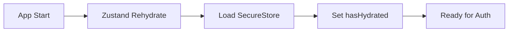

# Authentication Session Management Guide

## Overview

This document provides a comprehensive overview of how authentication and session management works in this Expo full-stack application. The system uses **Better Auth** with platform-specific optimizations for web and mobile environments.

## Table of Contents

1. [Session Storage Mechanism](#session-storage-mechanism)
2. [Session Validation Process](#session-validation-process)
3. [Determining Login Status](#determining-login-status)
4. [Authentication Flow](#authentication-flow)
5. [Session Persistence](#session-persistence)
6. [Key Components](#key-components)
7. [Security Features](#security-features)

## Session Storage Mechanism

The app uses a hybrid storage approach that differs between platforms:

### Web Platform
- **Storage**: `localStorage` for session persistence
- **Cookies**: HTTP-only cookies for server-side validation
- **Keys Used**:
  - `better-auth.session-token`
  - `better-auth.session_data`
  - `better-auth.user_data`

### Mobile Platform (iOS/Android)
- **Primary Storage**: `expo-secure-store` for secure device storage
- **Cache Layer**: In-memory storage via `global.__persistentStore` for synchronous access
- **Two-tier System**:
  1. Immediate in-memory storage for sync operations
  2. Asynchronous persistence to SecureStore for actual device storage

This dual approach solves the sync/async mismatch between Better Auth's expectations and React Native's storage APIs.

### State Management (Cross-platform)
- **Zustand Store**: Reactive state management with AsyncStorage persistence
- **Stores**: User object, session object, authentication state, last activity timestamp
- **Location**: `lib/stores/auth-store.ts`

## Session Validation Process

### 1. Initial App Load


- Zustand store rehydrates from AsyncStorage
- Mobile storage initializes by loading Better Auth keys from SecureStore
- The `hasHydrated` flag indicates when this process is complete

### 2. Session Verification
- **Web**: Better Auth client reads from localStorage cookies
- **Mobile**: Reads from the in-memory persistent store
- **Headers**: Session tokens included in API requests
  - Mobile: Authorization headers
  - Web: Cookies

### 3. Server-side Validation
- TRPC context (`createContext`) calls `auth.api.getSession()` on each request
- Better Auth validates the session token against the database
- Returns user and session data if valid

## Determining Login Status

The authentication state is determined through multiple layers:

### 1. Zustand Store State
```typescript
// Key indicators in auth-store.ts
{
  isAuthenticated: boolean,
  user: User | null,
  session: Session | null,
  hasHydrated: boolean
}
```

### 2. Route Protection
- **Native Protection**: `<Stack.Protected guard={isAuthenticated}>` in root `_layout.tsx`
- **Component Protection**: `ProtectedRoute` component for role-based access control
- **Location**: `app/_layout.tsx:187`

### 3. Session Freshness
- **Expiry**: 7-day session lifetime
- **Refresh**: Sessions refreshed after 1 day
- **Tracking**: `lastActivity` timestamp for user activity

## Authentication Flow

### Login Process
```
User submits credentials
    ↓
TRPC mutation (signIn)
    ↓
Better Auth validates
    ↓
Returns user + token
    ↓
Update Zustand store
    ↓
Session stored in platform storage
    ↓
Redirect to protected routes
```

### Key Steps

1. **Credential Submission**
   - Forms in `app/(auth)/login.tsx` or `app/(auth)/signup.tsx`
   - Validation via Zod schemas

2. **Session Establishment**
   - Web: Better Auth sets HTTP-only cookies + localStorage
   - Mobile: Token stored in SecureStore + in-memory cache
   - Zustand store updated with user and session objects

3. **Navigation Flow**
   - `app/index.tsx` checks authentication state
   - Redirects to `/(home)` if authenticated
   - Redirects to `/(auth)/login` if not authenticated
   - Protected routes guarded at Stack level

4. **Subsequent Requests**
   - TRPC client automatically includes session tokens
   - Server validates on each request via TRPC context

## Session Persistence

### Web Platform
- Sessions persist in localStorage
- Cookies maintain server-side session
- On app reload, Better Auth client reads from storage

### Mobile Platform

#### Cold Start Sequence
1. **Fast Recovery**: Zustand rehydrates from AsyncStorage
2. **Secure Load**: SecureStore data loaded into memory store (async)
3. **Immediate Access**: Better Auth client uses in-memory store

#### Session Recovery
- Token from storage automatically included in API requests
- Server validates and returns fresh session data
- Zustand store updated with server response

### Key Features
- **Auto-refresh**: Sessions refresh when close to expiry
- **Graceful Degradation**: Fallbacks if storage fails
- **Platform Optimizations**: Sync storage for web, async with cache for mobile

## Key Components

### Core Files
| File | Purpose |
|------|---------|
| `lib/auth-client.ts` | Better Auth client configuration |
| `lib/auth-session-manager.ts` | Platform-specific storage handling |
| `lib/stores/auth-store.ts` | Zustand authentication state |
| `hooks/useAuth.tsx` | React hook for auth operations |
| `components/ProtectedRoute.tsx` | Role-based route protection |
| `app/_layout.tsx` | Root layout with auth guards |

### Authentication Routes
- `app/(auth)/login.tsx` - Login screen
- `app/(auth)/signup.tsx` - Registration screen
- `app/(auth)/complete-profile.tsx` - Profile completion
- `app/(auth)/forgot-password.tsx` - Password recovery

### API Endpoints
- `app/api/auth/[...auth]+api.ts` - Better Auth API routes
- `app/api/auth/google-mobile-callback+api.ts` - OAuth callback handler

## Security Features

### OAuth Integration
- **Google OAuth**: Supported with platform-specific redirect handling
- **Callback URLs**: Different for web vs mobile environments
- **Token Issuance**: Session tokens issued after successful OAuth

### Role-Based Access Control
```typescript
// User roles defined in lib/validations/auth.ts
export const UserRole = z.enum([
  "admin",    // Full access
  "manager",  // Management features
  "user",     // Standard user
  "guest"     // Limited access
]);
```

- Roles stored in session data
- `ProtectedRoute` component enforces role requirements
- TRPC procedures can require specific roles

### Session Management
- **Manual Logout**: Clears all storage layers
- **Session Revocation**: Supported by Better Auth
- **Activity Tracking**: For compliance and security
- **Token Security**: Secure storage on mobile, HTTP-only cookies on web

## Best Practices

1. **Always check `hasHydrated`** before relying on auth state
2. **Use `useAuth` hook** for all auth operations
3. **Implement role checks** at both UI and API levels
4. **Handle session expiry** gracefully with auto-refresh
5. **Test auth flows** on all platforms (web, iOS, Android)

## Troubleshooting

### Common Issues

1. **"User not authenticated" on mobile**
   - Ensure SecureStore has loaded (`hasHydrated: true`)
   - Check if token exists in persistent store

2. **Session lost on refresh**
   - Verify localStorage is enabled (web)
   - Check SecureStore permissions (mobile)

3. **OAuth redirect failures**
   - Confirm redirect URLs match environment
   - Verify bundle identifier/package name

## Architecture Diagram

```
┌─────────────────┐     ┌──────────────────┐     ┌─────────────────┐
│   User Action   │────▶│  Auth Hook/API   │────▶│  Better Auth    │
└─────────────────┘     └──────────────────┘     └─────────────────┘
                                │                          │
                                ▼                          ▼
                        ┌──────────────────┐      ┌─────────────────┐
                        │  Zustand Store   │      │    Database     │
                        └──────────────────┘      └─────────────────┘
                                │
                    ┌───────────┴───────────┐
                    ▼                       ▼
            ┌──────────────────┐   ┌──────────────────┐
            │  Platform Store  │   │  Route Guards    │
            │ (Secure/Local)   │   │  (Protected)     │
            └──────────────────┘   └──────────────────┘
```

This architecture provides a robust, cross-platform authentication system that handles the complexities of web vs mobile environments while maintaining security best practices.