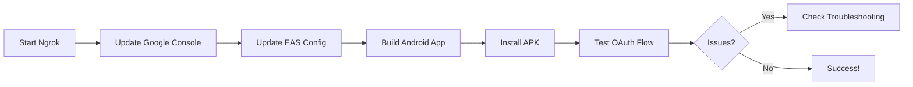

# OAuth Android Preview Build Testing Guide

**Created**: June 6, 2025  
**Purpose**: Complete guide for testing Google OAuth in Android preview builds using ngrok

## 🎯 Overview

This guide provides a step-by-step workflow for testing Google OAuth in Android preview builds using ngrok tunneling. This approach allows you to test OAuth with your local development server without deploying to production.

## 📋 Prerequisites

- [x] EAS CLI installed (`npm install -g eas-cli`)
- [x] Expo account and logged in (`eas login`)
- [x] Ngrok installed (`brew install ngrok` or download from ngrok.com)
- [x] Google OAuth credentials configured
- [x] Android device or emulator for testing

## 🚀 Quick Start

```bash
# Complete workflow in 4 commands
bun run ngrok:start          # 1. Start ngrok tunnel
bun run ngrok:update-eas     # 2. Update EAS config
bun run ngrok:build:android  # 3. Build Android app
# 4. Install APK and test!
```

## 📝 Detailed Steps

### 1. Start Ngrok Tunnel

```bash
# Start ngrok on port 8081
bun run ngrok:start

# You'll see output like:
# Forwarding https://abc123.ngrok-free.app -> http://localhost:8081
# 
# Ngrok URL saved to .ngrok-url
```

**Important**: Keep this terminal window open! Ngrok must stay running during your entire test session.

### 2. Configure Google OAuth Console

1. Go to [Google Cloud Console](https://console.cloud.google.com)
2. Navigate to APIs & Services → Credentials
3. Select your OAuth 2.0 Client ID
4. Add to **Authorized JavaScript origins**:
   ```
   https://abc123.ngrok-free.app
   ```
5. Add to **Authorized redirect URIs**:
   ```
   https://abc123.ngrok-free.app/api/auth/callback/google
   ```
6. Save changes

### 3. Update EAS Configuration

```bash
# This script reads the ngrok URL and updates eas.json
bun run ngrok:update-eas

# Verifies the update:
# ✓ Updated local-ngrok profile with URL: https://abc123.ngrok-free.app
```

### 4. Build Android Preview

```bash
# Build with ngrok profile
bun run ngrok:build:android

# Or manually:
eas build --profile local-ngrok --platform android
```

### 5. Monitor Build Progress

- Watch build at: https://expo.dev/accounts/[your-username]/projects/[project-name]/builds
- Build typically takes 5-15 minutes
- You'll receive an email when complete

### 6. Install and Test

1. **Download APK** from EAS build page
2. **Install on device**:
   ```bash
   # Using adb
   adb install path/to/your-app.apk
   
   # Or transfer to device and install manually
   ```
3. **Start your local server**:
   ```bash
   bun run dev
   ```
4. **Test OAuth flow**:
   - Open the app
   - Navigate to login
   - Click "Continue with Google"
   - Complete authentication
   - Verify redirect back to app

## 🔧 Configuration Details

### EAS Profile: local-ngrok

```json
{
  "local-ngrok": {
    "extends": "development",
    "env": {
      "EXPO_PUBLIC_API_URL": "https://your-ngrok-url.ngrok-free.app",
      "BETTER_AUTH_BASE_URL": "https://your-ngrok-url.ngrok-free.app/api/auth",
      // OAuth credentials and database URL included
    }
  }
}
```

### Environment Variables

The ngrok profile includes:
- `EXPO_PUBLIC_API_URL` - Points to ngrok URL
- `GOOGLE_CLIENT_ID` - Your OAuth client ID
- `GOOGLE_CLIENT_SECRET` - Your OAuth client secret
- `BETTER_AUTH_SECRET` - Auth session secret
- `DATABASE_URL` - Neon PostgreSQL connection

## 🐛 Troubleshooting

### Ngrok Connection Issues

```bash
# Check if ngrok is running
curl https://your-ngrok-url.ngrok-free.app/api/health

# Restart ngrok if needed
killall ngrok
bun run ngrok:start
bun run ngrok:update-eas
```

### OAuth Redirect Failures

1. **Verify Google Console Settings**
   - Ngrok URL in authorized origins
   - Callback URL in redirect URIs
   - OAuth consent screen configured

2. **Check App Logs**
   ```bash
   # View device logs
   adb logcat | grep -i oauth
   ```

3. **Verify Server Running**
   ```bash
   # Should return { status: "ok" }
   curl http://localhost:8081/api/health
   ```

### Build Failures

```bash
# Clear EAS cache and retry
eas build:cancel [build-id]
eas build --clear-cache --profile local-ngrok --platform android
```

## 📱 Testing Checklist

- [ ] Ngrok tunnel running
- [ ] Google OAuth Console updated with ngrok URL
- [ ] EAS configuration updated (`bun run ngrok:update-eas`)
- [ ] Local server running (`bun run dev`)
- [ ] APK installed on test device
- [ ] Can navigate to login screen
- [ ] Google OAuth button works
- [ ] Successfully authenticate with Google
- [ ] Redirect back to app works
- [ ] User session persists

## 🚨 Important Notes

1. **Ngrok URL Changes**: Every time you restart ngrok, you get a new URL. You must:
   - Update Google OAuth Console
   - Run `bun run ngrok:update-eas`
   - Rebuild the app

2. **Keep Ngrok Running**: Don't close the ngrok terminal during testing

3. **Free Ngrok Limits**: 
   - 40 connections/minute
   - URLs expire after 2 hours of inactivity
   - Consider ngrok paid plan for stable URLs

4. **Security**: Never commit ngrok URLs or credentials to git

## 🔄 Workflow Summary



## 📚 Related Documentation

- [Mobile OAuth Development Build Guide](../MOBILE_OAUTH_DEVELOPMENT_BUILD.md)
- [Google OAuth Setup](../GOOGLE_OAUTH_SETUP.md)
- [Preview Build Guide](../deployment/PREVIEW_BUILD_GUIDE.md)
- [EAS Build Documentation](https://docs.expo.dev/build/introduction/)

## 🎉 Success Criteria

Your OAuth setup is working when:
1. ✅ App opens without crashes
2. ✅ Google sign-in button is visible
3. ✅ Clicking button opens Google auth page
4. ✅ After auth, redirects back to app
5. ✅ User is logged in with profile data
6. ✅ Session persists across app restarts

---

**Pro Tip**: Save your working ngrok URL and Google Console settings for future reference. Consider using a paid ngrok plan for a stable subdomain during development.