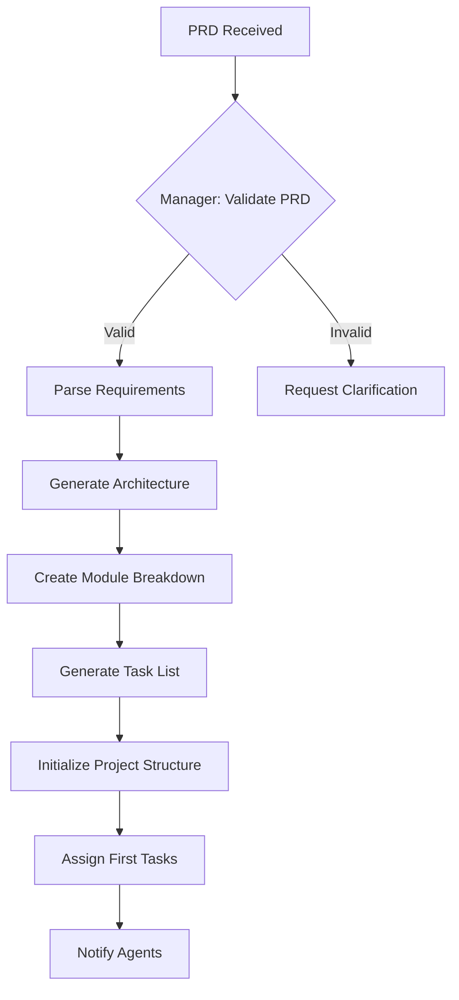
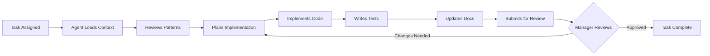
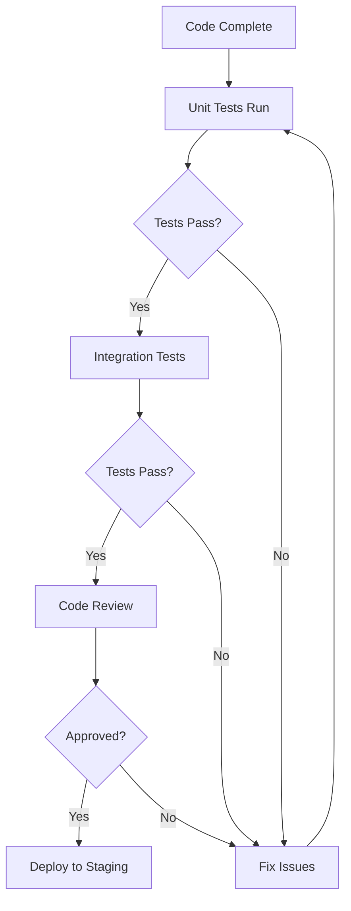

# 🎯 Workflow Triggers & Execution Flows

*Version: 1.0.0 | Last Updated: June 6, 2025*

## 📋 Overview

This document defines all workflow triggers, execution sequences, and decision flows for the multi-agent system.

## 🚀 PRD to Production Flow

### Phase 1: Project Initialization



#### Trigger Sequence
```yaml
Step 1 - PRD Processing:
  trigger: "Manager, process PRD at docs/projects/[name]/PRD.md"
  
  manager_actions:
    - validate_prd:
        checks:
          - All sections present
          - Requirements clear
          - Tech stack defined
          - Success metrics defined
    
    - extract_features:
        output:
          - Feature list with priorities
          - User stories
          - Acceptance criteria
    
    - design_architecture:
        creates:
          - System architecture diagram
          - Module dependencies
          - API structure
          - Database schema
    
    - generate_tasks:
        for_each_feature:
          - Break into subtasks
          - Define dependencies
          - Estimate effort
          - Set acceptance criteria
    
    - create_sprint_plan:
        sprint_1:
          - MVP features only
          - Core infrastructure
          - Basic UI/UX
          - Authentication

Step 2 - Agent Initialization:
  trigger: "Manager, initialize agents for project"
  
  for_each_agent:
    - Load AGENT_CONTEXT.md
    - Load project-specific context
    - Review assigned tasks
    - Confirm readiness
```

### Phase 2: Development Execution



#### Daily Workflow Triggers

```typescript
// Morning Standup (9:00 AM)
async function morningStandup() {
  // Trigger: "Manager, start daily standup"
  
  const agents = ['Backend Developer', 'Frontend Developer', 'Tester'];
  
  for (const agent of agents) {
    await execute(`
      ${agent}, provide standup update:
      1. What did you complete yesterday?
      2. What will you work on today?
      3. Any blockers or concerns?
      4. Do you need help with anything?
    `);
  }
  
  // Manager summarizes and adjusts
  await execute(`
    Manager, based on standup:
    1. Update task assignments if needed
    2. Address any blockers
    3. Adjust sprint plan if necessary
    4. Update MASTER_TASK_MANAGER.md
  `);
}

// Task Assignment (Continuous)
async function assignTask(taskId: string) {
  // Trigger: "Manager, assign next task"
  
  await execute(`
    Manager, assign ${taskId}:
    1. Check task dependencies
    2. Verify prerequisites complete
    3. Select best available agent
    4. Provide context and resources
    5. Set expected completion time
  `);
}

// Code Review (On PR)
async function codeReview(taskId: string, agent: string) {
  // Trigger: "[Agent], submit TASK-001 for review"
  
  await execute(`
    Manager, review ${taskId} from ${agent}:
    1. Check acceptance criteria met
    2. Verify code quality standards
    3. Run automated checks
    4. Review test coverage
    5. Provide feedback or approve
  `);
}
```

### Phase 3: Testing & Quality Assurance



#### Testing Workflow Triggers

```yaml
Automated Test Triggers:
  on_commit:
    - Run type check
    - Run linter
    - Run unit tests
    
  on_pull_request:
    - All commit checks
    - Integration tests
    - Coverage report
    
  on_merge:
    - Full test suite
    - E2E tests
    - Performance tests

Manual Test Triggers:
  feature_complete:
    trigger: "Tester, test [FEATURE] implementation"
    actions:
      - Review requirements
      - Create test scenarios
      - Execute manual tests
      - Report findings
      
  regression_test:
    trigger: "Tester, run regression suite"
    actions:
      - Test all features
      - Verify no breaks
      - Check performance
      - Update test docs
```

## 🔄 Conditional Workflows

### 1. Dependency Management

```typescript
interface TaskDependency {
  taskId: string;
  dependsOn: string[];
  canStart: () => boolean;
}

// Automatic dependency checking
function checkDependencies(task: TaskDependency): boolean {
  return task.dependsOn.every(depId => 
    getTaskStatus(depId) === 'completed'
  );
}

// Trigger when dependencies met
onTaskComplete((completedTask) => {
  const waitingTasks = getTasksWaitingFor(completedTask.id);
  
  waitingTasks.forEach(task => {
    if (checkDependencies(task)) {
      trigger(`Manager, ${task.id} dependencies met, assign to agent`);
    }
  });
});
```

### 2. Parallel Execution Management

```typescript
// Identify parallel opportunities
function identifyParallelTasks(tasks: Task[]): TaskGroup[] {
  const groups: TaskGroup[] = [];
  const assigned = new Set<string>();
  
  tasks.forEach(task => {
    if (!assigned.has(task.id) && !task.dependsOn.length) {
      const group = [task];
      assigned.add(task.id);
      
      // Find other independent tasks
      tasks.forEach(other => {
        if (!assigned.has(other.id) && 
            !other.dependsOn.length &&
            other.type !== task.type) {
          group.push(other);
          assigned.add(other.id);
        }
      });
      
      groups.push({ tasks: group, parallel: true });
    }
  });
  
  return groups;
}

// Execute parallel groups
async function executeParallelGroup(group: TaskGroup) {
  const promises = group.tasks.map(task => 
    trigger(`${getAgentForTask(task)}, implement ${task.id}`)
  );
  
  await Promise.all(promises);
}
```

### 3. Error Recovery Workflows

```yaml
Error Scenarios:

1. Build Failure:
   trigger: "Build failed for [TASK-ID]"
   workflow:
     - Analyze error logs
     - Identify root cause
     - If syntax error:
         - Fix and retry
     - If dependency issue:
         - Update dependencies
         - Clear cache
         - Retry build
     - If persistent:
         - Escalate to Manager
         - Get expert help

2. Test Failure:
   trigger: "Tests failing for [TASK-ID]"
   workflow:
     - Check if tests outdated
     - Verify implementation correct
     - If implementation bug:
         - Fix code
         - Update tests
     - If test bug:
         - Fix test
         - Re-run suite
     - Document fix

3. Merge Conflict:
   trigger: "Merge conflict in [BRANCH]"
   workflow:
     - Identify conflicting files
     - Understand both changes
     - Resolve preserving both intents
     - Test thoroughly
     - Document resolution
```

## 📊 Progress Tracking Triggers

### 1. Velocity Tracking

```typescript
// Daily velocity update
scheduleTrigger('daily', '6:00 PM', async () => {
  await execute(`
    Manager, calculate daily velocity:
    1. Count completed story points
    2. Update burndown chart
    3. Adjust predictions
    4. Flag if behind schedule
  `);
});

// Sprint velocity analysis
scheduleTrigger('sprint-end', async () => {
  await execute(`
    Manager, analyze sprint velocity:
    1. Calculate completed vs planned
    2. Identify bottlenecks
    3. Adjust future capacity
    4. Generate insights report
  `);
});
```

### 2. Blocker Detection

```typescript
// Automatic blocker detection
function detectBlockers() {
  const rules = [
    {
      condition: (task: Task) => 
        task.status === 'in_progress' && 
        daysSince(task.startedAt) > task.estimatedDays * 1.5,
      action: 'Flag as potentially blocked'
    },
    {
      condition: (task: Task) =>
        task.failedAttempts > 2,
      action: 'Escalate to Manager'
    }
  ];
  
  tasks.forEach(task => {
    rules.forEach(rule => {
      if (rule.condition(task)) {
        trigger(`Manager, investigate potential blocker on ${task.id}`);
      }
    });
  });
}
```

## 🎯 Smart Triggers

### 1. Context-Aware Assignment

```typescript
function smartAssignment(task: Task): Agent {
  const factors = {
    expertise: getAgentExpertise(),
    workload: getAgentWorkload(),
    availability: getAgentAvailability(),
    pastPerformance: getHistoricalData()
  };
  
  // Score each agent
  const scores = agents.map(agent => ({
    agent,
    score: calculateScore(agent, task, factors)
  }));
  
  // Select best agent
  return scores.sort((a, b) => b.score - a.score)[0].agent;
}
```

### 2. Adaptive Planning

```typescript
function adaptivePlanning() {
  const metrics = {
    velocity: getTeamVelocity(),
    quality: getQualityMetrics(),
    blockers: getBlockerFrequency()
  };
  
  if (metrics.velocity < planned * 0.8) {
    trigger('Manager, adjust sprint scope - team under capacity');
  }
  
  if (metrics.quality < threshold) {
    trigger('Manager, increase testing focus - quality declining');
  }
  
  if (metrics.blockers > acceptable) {
    trigger('Manager, review process - too many blockers');
  }
}
```

## 🔧 Utility Triggers

### Quick Commands
```bash
# Status checks
"Manager, status"                    # Overall project status
"Manager, sprint status"             # Current sprint progress
"Manager, agent status"              # All agents' current work

# Task management  
"Manager, next task for [Agent]"     # Assign next priority
"Manager, reassign [TASK-ID]"        # Move task to different agent
"Manager, split [TASK-ID]"           # Break large task down

# Reporting
"Manager, daily report"              # Generate daily summary
"Manager, sprint report"             # Sprint progress report
"Manager, blocker report"            # All current blockers

# Quality
"Manager, code quality report"       # Metrics across codebase
"Manager, test coverage"             # Current coverage stats
"Manager, performance metrics"       # App performance data
```

## 📈 Continuous Improvement

### Learning Triggers
```yaml
Post-Task Learning:
  trigger: "Task [ID] completed"
  actions:
    - Analyze what went well
    - Identify challenges
    - Document patterns discovered
    - Update best practices
    - Share with team

Post-Sprint Learning:
  trigger: "Sprint [N] completed"
  actions:
    - Team retrospective
    - Process improvements
    - Tool optimizations
    - Workflow adjustments
    - Update documentation
```

---

*This comprehensive trigger system ensures smooth, automated workflow execution from PRD to production.*
## 📚 Automated Workflow Scripts

### Master Project Development Script

```typescript
// Complete project initialization and development flow
async function developProject(prdPath: string) {
  // Phase 1: Initialize project
  await execute('Manager, process PRD at ' + prdPath);
  await execute('Manager, create project structure');
  await execute('Manager, initialize agents for project');
  
  // Phase 2: Sprint planning
  await execute('Manager, plan sprint 1');
  await execute('Manager, assign sprint tasks');
  
  // Phase 3: Development cycles
  while (hasRemainingTasks()) {
    await execute('Manager, start daily standup');
    await executeParallel([
      'Backend Developer, work on assigned tasks',
      'Frontend Developer, work on assigned tasks',
      'Tester, work on assigned tasks'
    ]);
    await execute('Manager, end of day sync');
  }
  
  // Phase 4: Delivery
  await execute('Manager, prepare release');
  await execute('EAS Agent, build production');
  await execute('Manager, notify user: Project complete\!');
}
```

### Quick Command Scripts

```bash
# Initialize new project
Manager, process PRD at docs/projects/[name]/PRD.md

# Daily operations
Manager, start daily standup
Manager, show sprint progress
Manager, assign next tasks

# Git operations
Git Agent, create feature branch [name]
Git Agent, create pull request
Git Agent, merge to main

# Build operations  
EAS Agent, build iOS preview
EAS Agent, distribute to testers

# Quality checks
Tester, run full test suite
Manager, generate quality report
```

EOF < /dev/null